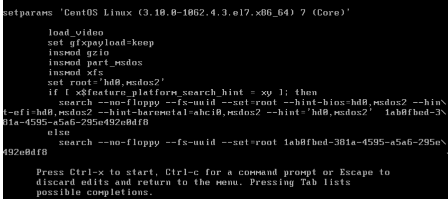
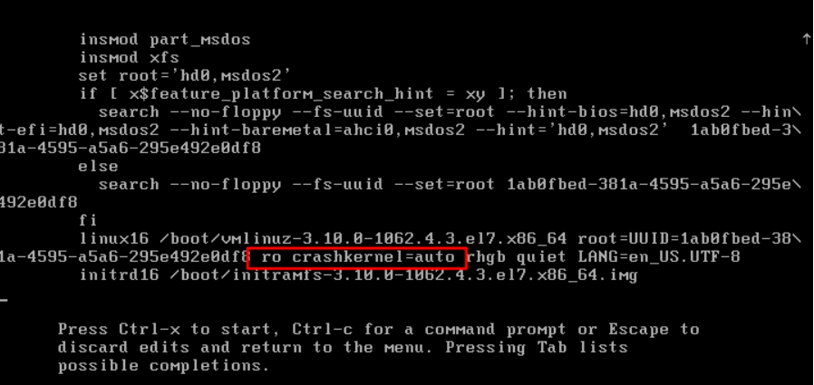

# zsh卸载后root无法登录

> 主要参考文档 https://blog.csdn.net/Scoful/article/details/119746150

1. 重启，开机引导进入下面的那个，按e进入编辑模式



2. 移动光标，找到```ro crashkernel=auto```，修改为 ```rw init=sysroot/bin/sh```

   

3. 按ctrl+x进入单用户模式界面


4. 输入chroot /sysroot 获取权限
5. vim /etc/passwd
6. 第一行 ，root ......zsh，中```/bin/zsh```，改为```/bin/bash```
7. 用```touch /.autorelabel```更新SELinux信息
8. 两次exit 推出chroot
9. reboot 重启：需要一定时间，耐心等待

# vm扩容centos7

这里是因为我在vm手动扩容后，进入centos7系统---用了 可视化界面中的disk软件直接扩容，发生错误（具体错误我没注意，一闪而过了），后面呢我再使用命令```resize2fs /dev/sda3```的时候，发现总是提示 busy

## 解决办法

按照上面的办法，进入到第3步结束之后（**按ctrl+x进入单用户模式界面** 要做）  
输入 umount /dev/sda3 进行卸载  
然后输入下面进行修复（极为重要），然后出现问题是否修复一直按'y'即可  

```shell
xfs_repair /dev/sda4
注：如果你当前文件系统是ext4，可以执行fsck.ext4 /dev/sda4
```

然后输入 mount /dev/sda3 / 进行挂载（这步可能不需要）  
最后 reboot 重启    
重启之后，再执行 ```resize2fs /dev/sda3``` 即可