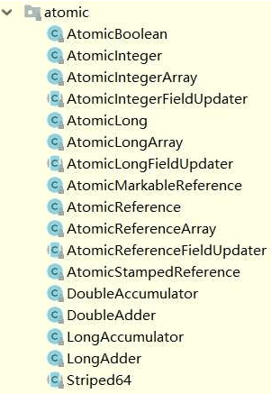
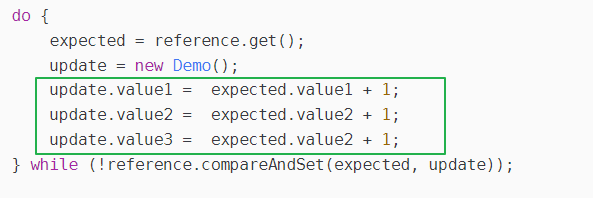

### Java实现CAS的原理[非javaguide]

i++是非线程安全的，因为**i++不是原子**操作；可以使用**synchronized和CAS实现加锁**

**synchronized是悲观锁**，一旦获得锁，其他线程进入后就会阻塞等待锁；而**CAS是乐观锁**，执行时不会加锁，假设没有冲突，**如果因为冲突失败了就重试**，直到成功

- 乐观锁和悲观锁

  - 这是一种分类方式
  - **悲观锁**，总是认为**每次访问共享资源会发生冲突**，所以**必须对每次数据操作加锁**，以**保证临界区的程序同一时间只能有一个线程**在执行
  - 乐观锁，又称**“无锁”**，**假设对共享资源访问没有冲突**，线程可以不停的执行，无需加锁无需等待；一旦发生冲突，通常是使用一种称为CAS的技术保证线程执行安全  
    - 无锁没有锁的存在，因此不可能发生死锁，即**乐观锁天生免疫死锁**
    - 乐观锁用于**“读多写少”**的环境，**避免加锁频繁影响性能**；悲观锁用于**“写多读少”**，避免**频繁失败及重试**影响性能

- CAS概念，即CompareAndSwap ，比较和交换，CAS中，有三个值（概念上）  
  V：要更新的变量(var)；E：期望值（expected）；N：新值（new）
  判断V是否等于E，如果等于，将V的值设置为N；如果不等，说明已经有其它线程更新了V，则当前线程放弃更新，什么都不做。
  一般来说，预期值E本质上指的是“旧值”（判断是否修改了）

  > 1. 如果有一个多个线程共享的变量`i`原本等于5，我现在在线程A中，想把它设置为新的值6;
  > 2. 我们使用CAS来做这个事情；
  > 3. （首先要把原来的值5在线程中保存起来）
  > 4. 接下来是原子操作：首先我们**用（现在的i）去与5对比，发现它等于5，说明没有被其它线程改过，那我就把它设置为新的值6**，此次CAS成功，`i`的值被设置成了6；
  > 5. 如果不等于5，说明`i`被其它线程改过了（比如现在`i`的值为2），那么我就什么也不做，此次CAS失败，`i`的值仍然为2。

> 其中i为V，5为E，6为N

CAS是一种原子操作，它是一种系统原语，是一条CPU原子指令，从CPU层面保证它的原子性（**不可能出现说，判断了对比了i为5之后，正准备更新它的值，此时该值被其他线程改了**）

当**多个线程同时使用CAS操作一个变量**时，**只有一个会胜出，并成功更新**，**其余均会失败**，但**失败的线程并不会被挂起**，仅是**被告知失败，并且允许再次尝试**，当然也**允许失败的线程放弃**操作。

- Java实现CAS的原理 - Unsafe类

  - 在Java中，如果一个方法是native的，那Java就不负责具体实现它，而是交给底层的JVM使用c或者c++去实现

  - Java中有一个Unsafe类，在sun.misc包中，里面有一些native方法，其中包括：  

    > ```java
    > boolean compareAndSwapObject(Object o, long offset,Object expected, Object x);
    > boolean compareAndSwapInt(Object o, long offset,int expected,int x);
    > boolean compareAndSwapLong(Object o, long offset,long expected,long x);
    > 
    > 
    > //------>AtomicInteger.class
    > 
    > public class AtomicInteger extends Number implements java.io.Serializable {
    > private static final long serialVersionUID = 6214790243416807050L;
    > 
    > // setup to use Unsafe.compareAndSwapInt for updates
    > private static final Unsafe unsafe = Unsafe.getUnsafe();
    > private static final long valueOffset;
    > 
    > static {
    >   try {
    >       valueOffset = unsafe.objectFieldOffset
    >           (AtomicInteger.class.getDeclaredField("value"));
    >   } catch (Exception ex) { throw new Error(ex); }
    > }
    > 
    > private volatile int value;
    > public final int getAndIncrement() {
    > 	return unsafe.getAndAddInt(this, valueOffset, 1);
  > 	}
    > }
  > ```
    
    **Unsafe中对CAS的实现是C++**写的，它的具体实现和操作系统、CPU都有关系。Linux的X86中主要通过**cmpxchgl**这个指令在CPU级完成CAS操作，如果是多处理器则必须使用**lock指令**加锁
    
    Unsafe类中还有**park(线程挂起)**和**unpark(线程恢复)**，LockSupport底层则调用了该方法；还有支持反射操作的**allocateInstance()**

- 原子操作- AtomicInteger类源码简析
  JDK提供了一些原子操作的类，在java.util.concurrent.atomic包下面，JDK11中有如下17个类
  

  - 包括 **原子更新基本类型**，**原子更新数组**，**原子更新引用**，**原子更新字段(属性)**

  - 其中，AtomicInteger类的getAndAdd(int data)

    ```java
     public final int getAndAdd(int delta) {
            return unsafe.getAndAddInt(this, valueOffset, delta);
        }
    //unsafe字段
    private static final jdk.internal.misc.Unsafe U = jdk.internal.misc.Unsafe.getUnsafe();
    //上面方法实际调用
    @HotSpotIntrinsicCandidate
    public final int getAndAddInt(Object o, long offset, int delta) {
        int v;
        do {
            v = getIntVolatile(o, offset);
        } while (!weakCompareAndSetInt(o, offset, v, v + delta));
        return v;
    }
    //对于offset，这是一个对象偏移量，用于获取某个字段相对Java对象的起始地址的偏移量
    /*
    一个java对象可以看成是一段内存，各个字段都得按照一定的顺序放在这段内存里，同时考虑到对齐要求，可能这些字段不是连续放置的，
    
    用这个方法能准确地告诉你某个字段相对于对象的起始内存地址的字节偏移量，因为是相对偏移量，所以它其实跟某个具体对象又没什么太大关系，跟class的定义和虚拟机的内存模型的实现细节更相关。
    */
    public class AtomicInteger extends Number implements java.io.Serializable {
        private static final long serialVersionUID = 6214790243416807050L;
    
        // setup to use Unsafe.compareAndSwapInt for updates
        private static final Unsafe unsafe = Unsafe.getUnsafe();
        private static final long valueOffset;
    
        static {
            try {
                valueOffset = unsafe.objectFieldOffset
                    (AtomicInteger.class.getDeclaredField("value"));
            } catch (Exception ex) { throw new Error(ex); }
        }
    
        private volatile int value;
        public final int getAndIncrement() {
        	return unsafe.getAndAddInt(this, valueOffset, 1);
    	}
    }
    ```

    再重新看这段代码

    ```java
    @HotSpotIntrinsicCandidate
    public final int getAndAddInt(Object o, long offset, int delta) {
        int v;
        do {
            v = getIntVolatile(o, offset);
        } while (!weakCompareAndSetInt(o, offset, v, v + delta));
        return v;
    }
    ```

    这里声明了v，即要返回的值，即**不论如何都会返回原来的值(更新成功前的值)**，然后新的值为v+delta

    使用do-while保证所有循环至少执行一遍  
    循环体的条件是一个CAS方法：  

    ```java
    public final boolean weakCompareAndSetInt(Object o, long offset,
                                              int expected,
                                              int x) {
        return compareAndSetInt(o, offset, expected, x);
    }
    
    public final native boolean compareAndSetInt(Object o, long offset,
                                                 int expected,
                                                 int x);
    ```

    最终调用了native方法：compareAndSetInt方法

    > 为甚么要经过一层weakCompareAndSetInt，在JDK 8及之前的版本，这两个方法是一样的。
    >
    > 而在JDK 9开始，这两个方法上面增加了@HotSpotIntrinsicCandidate注解。这个注解**允许HotSpot VM自己来写汇编**或**IR编译器**来实现该方法以提供性能。也就是说虽然外面看到的在JDK9中weakCompareAndSet和compareAndSet底层依旧是调用了一样的代码，但是不排除**HotSpot VM会手动来实现weakCompareAndSet**真正含义的功能的可能性。
    >
    > 简单来说，`weakCompareAndSet`操作仅保留了`volatile`自身变量的特性，而除去了happens-before规则带来的内存语义。也就是说，`weakCompareAndSet`**无法保证处理操作目标的volatile变量外的其他变量的执行顺序( 编译器和处理器为了优化程序性能而对指令序列进行重新排序 )，同时也无法保证这些变量的可见性。**这在一定程度上可以提高性能。（没看懂）

    CAS如果旧值V不等于预期值E，它就会更新失败。说明旧的值发生了变化。那我们当然需要返回的是被其他线程改变之后的旧值了，因此放在了do循环体内

- CAS实现原子操作的三大问题

  - ABA问题

    - 就是一个值**原来是A，变成了B，又变回了A**。这个时候使用CAS是检查不出变化的，但实际上却被更新了两次

    - 在变量前面追加上**版本号或者时间戳**。从JDK 1.5开始，JDK的atomic包里提供了一个类`AtomicStampedReference`类来解决ABA问题

    - `AtomicStampedReference`类的`compareAndSet`方法的作用是首先检查当前引用是否等于预期引用，并且检查当前标志是否等于预期标志，如果二者都相等，才使用CAS设置为新的值和标志。

      > ```java
      > public boolean compareAndSet(V   expectedReference,
      >                           V   newReference,
      >                           int expectedStamp,
      >                           int newStamp) {
      >  Pair<V> current = pair;
      >  return
      >      expectedReference == current.reference &&
      >      expectedStamp == current.stamp &&
      >      ((newReference == current.reference &&
      >        newStamp == current.stamp) ||
      >       casPair(current, Pair.of(newReference, newStamp)));
      > }
      > ```

  - 循环时间长开销大

    - CAS多与自旋结合，如果自旋CAS长时间不成功，则会占用大量CPU资源，解决思路是让**JVM支持处理器提供的pause指令**

      > pause指令能让自旋失败时cpu睡眠一小段时间再继续自旋，从而使得读操作的频率低很多,为解决内存顺序冲突而导致的CPU流水线重排的代价也会小很多。

    - 限制次数（如果可以放弃操作的话）

  - 只能保证一个共享变量的原子操作

    - 使用JDK 1.5开始就提供的`AtomicReference`类保证对象之间的原子性，把多个变量放到一个对象里面进行CAS操作；
    - 使用锁。锁内的临界区代码可以保证只有当前线程能操作。


### AtomicInteger的使用[非javaguide]

```java
//AtomicInteger类常用方法(下面的自增，都使用了CAS，是同步安全的)
ublic final int get() //获取当前的值
public final int getAndSet(int newValue)//获取当前的值，并设置新的值
public final int getAndIncrement()//获取当前的值，并自增
public final int getAndDecrement() //获取当前的值，并自减
public final int getAndAdd(int delta) //获取当前的值，并加上预期的值
boolean compareAndSet(int expect, int update) //如果输入的数值等于预期值，则以原子方式将该值设置为输入值（update）
public final void lazySet(int newValue)//最终设置为newValue,使用 lazySet 设置之后可能导致其他线程在之后的一小段时间内还是可以读到旧的值。
------
//使用如下
class AtomicIntegerTest {
    private AtomicInteger count = new AtomicInteger();
    //使用AtomicInteger之后，不需要对该方法加锁，也可以实现线程安全。
    public void increment() {
        count.incrementAndGet();
    }

    public int getCount() {
        return count.get();
    }
} 
```

### 浅谈AtomicInteger实现原理[非javaguide]

1. 位于Java.util.concurrent.atomic包下，对int封装，提供**原子性的访问和更新**操作，其原子性操作的实现基于CAS（CompareAndSet）

   - CAS，比较并交换，Java并发中lock-free机制的基础，调用Sun的Unsafe的CompareAndSwapInt完成，为native方法，**基于CPU的CAS**指令来实现的，即无阻塞；且为CAS原语

   - CAS：三个参数，1. 当前内存值V 2.旧的预期值  3.即将更新的值，当且仅当预期值A和内存值相同时，将内存值改为 8 并返回true；否则返回false ```在JAVA中,CAS通过调用C++库实现，由C++库再去调用CPU指令集。```

   - CAS确定

     - ABA　问题
       如果期间发生了 A -> B -> A 的更新，仅仅判断数值是 A，可能导致不合理的修改操作；为此，提供了AtomicStampedReference 工具类，为引用建立类似版本号ｓｔａｍｐ的方式

     - 循环时间长，开销大。CAS适用于**竞争情况短暂**的情况，有需要的时候要限制自旋次数，以免过度消耗CPU

     - 只能保证一个共享变量的原子操作
       对多个共享变量操作时，循环CAS就无法保证操作的原子性，这个时候就可以用锁；或者取巧一下，比如 i = 2 , j = a ，合并后为 ij = 2a ，然后cas操作2a 

       > Java1.5开始JDK提供了**AtomicReference**类来保证引用对象之间的原子性，你可以把**多个变量放在一个对象**里来进行CAS操作，例子如下：
       > 
       > 如图，它是**同时更新了两个变量**，而**这两个变量都在新的对象**上，所以就能解决多个共享变量的问题，即“将问题转换成，**如果变量更新了，则更换一个对象**”

2. AtomicInteger原理浅析

   一些公共属性：

   ```java
   public class AtomicInteger extends Number implements java.io.Serializable {
       private static final long serialVersionUID = 6214790243416807050L;
   
       // setup to use Unsafe.compareAndSwapInt for updates
       private static final Unsafe unsafe = Unsafe.getUnsafe();
       private static final long valueOffset;
   
       static {
           try {
               valueOffset = unsafe.objectFieldOffset
                   (AtomicInteger.class.getDeclaredField("value"));
           } catch (Exception ex) { throw new Error(ex); }
       }
   
       private volatile int value;
   }
   ```

   AtomicInteger，根据**valueOffset**代表的该变量值，**在内存中的偏移地址**，从而获取数据；且value用volatile修饰，保证多线程之间的可见性

   ```java
   public final int getAndIncrement() {
       return unsafe.getAndAddInt(this, valueOffset, 1);
   }
   
   //unsafe.getAndAddInt
   public final int getAndAddInt(Object var1, long var2, int var4) {
       int var5;
       do {
           var5 = this.getIntVolatile(var1, var2);
       } while(!this.compareAndSwapInt(var1, var2, var5, var5 + var4));//先获取var1对象的偏移量为var2的内存地址上的值【现在的实际值】
   //如果此刻还是var5，+1并赋值，否则重新获取
   
       return var5;
   }
   ```

   - 假设线程1和线程2**通过getIntVolatile拿到value的值**都为1，线程1被挂起，线程2继续执行 （**这里是非原子的哦**）
   - 线程2在compareAndSwapInt操作中由于预期值和内存值都为1，因此成功将内存值更新为2
   - 线程1继续执行，**在compareAndSwapInt操作中，预期值是1，而当前的内存值为2**，CAS操作失败，什么都不做，返回false
   - 线程1重新通过getIntVolatile拿到最新的value为2，再进行一次compareAndSwapInt操作，这次操作成功，内存值更新为3

3. 原子操作的实现原理

   - Java中的CAS操作正是利用了处理器提供的CMPXCHG指令实现的。自旋CAS实现的基本思路就是循环进行CAS操作直到操作成功为止。
   - 在CAS中有三个操作数：分别是**内存地址**（在Java中可以简单理解为变量的内存地址，用V表示，**要获取实时值**）、**旧的预期值**（用A表示,[**操作之前保存的**]）和**新值**（用B表示）。CAS指令执行时，当且仅当V符合旧的预期值A时，处理器才会用新值B更新V的值，否则他就不执行更新，但无论是否更新了V的值，都会返回V的旧值。(**这里说的三个值，指的是逻辑概念，而不是实际概念**)