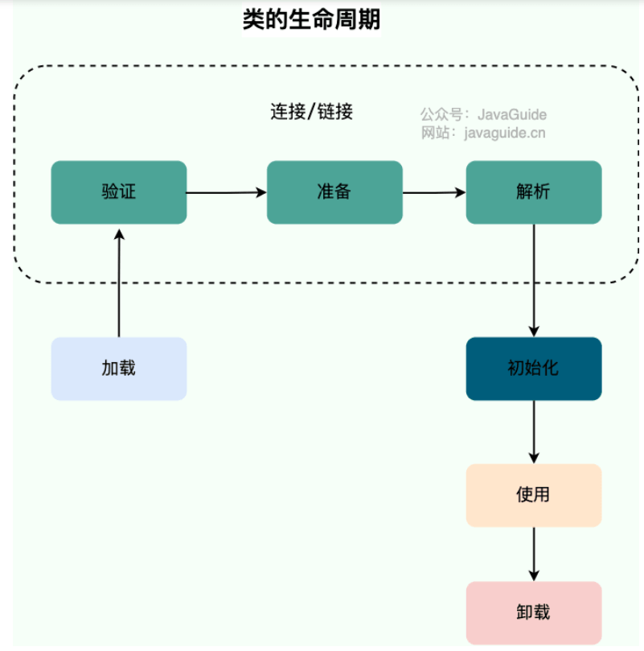
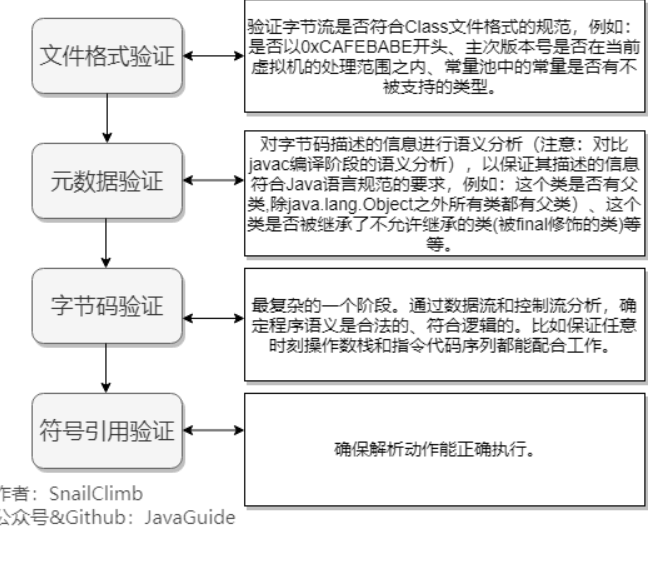
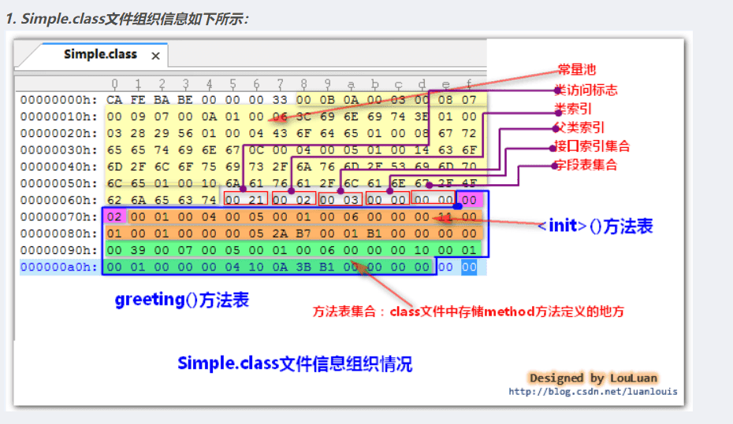
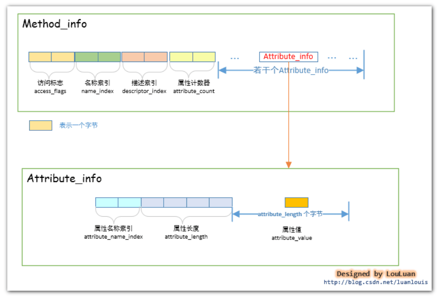
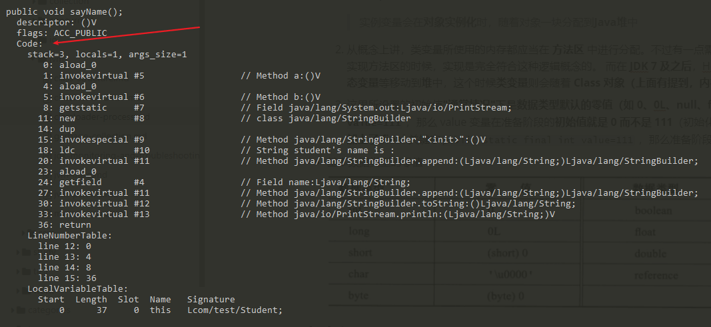
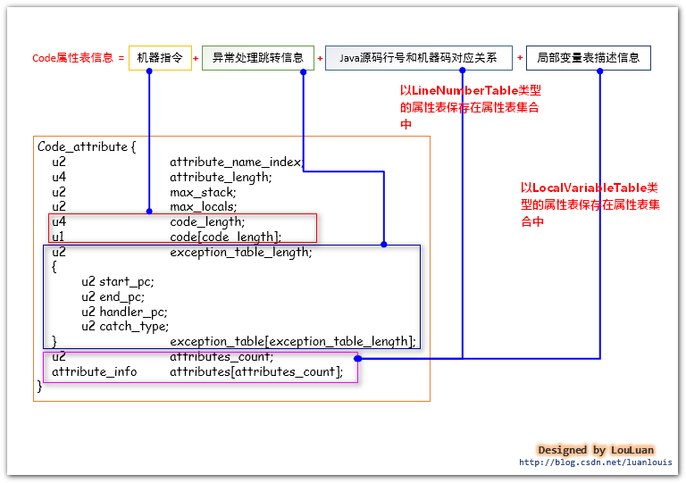
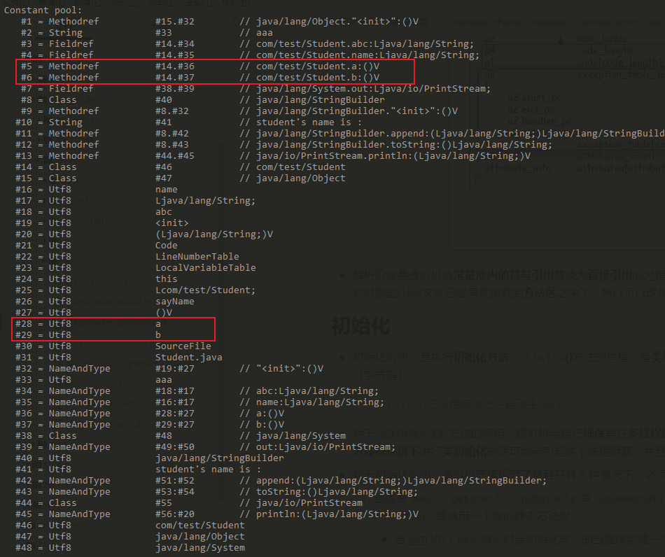
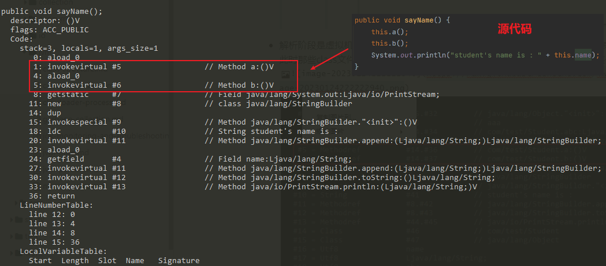

> 转载自https://github.com/Snailclimb/JavaGuide（添加小部分笔记）感谢作者!

# 类的声明周期



# 类加载过程

- Class文件，需要**加载到虚拟机中**之后才能运行和使用，那么虚拟机是**如何加载**这些Class文件呢
- 系统加载Class类文件需要三步：**加载**->**连接**->**初始化**。连接过程又分为三步：**验证**->**准备**->**解析**  
  

## 加载

类加载的第一步，主要完成3件事情

> **构造与类相关联的方法表**

1. **通过全类名**获取定义此类的**二进制字节流**
2. 将**字节流**所代表的**静态存储结构**，转换为**方法区**的**运行时数据结构**
3. 在内存中生成一个该类的**Class对象**，作为**方法区**这些数据的访问入口

> 虚拟机规范对上面3点不具体，比较灵活
>
> 1. 对于1 没有具体指明从哪里获取、怎样获取。可以从ZIP包读取 （JAR/EAR/WAR格式的基础）、其他文件生成（JSP）等

- 非数组类的加载阶段（加载阶段**获取类的二进制字节流**的动作）是可控性最强的阶段，这一步我们可以去完成还可以**自定义类加载器**去**控制字节流**的获取方式（重写一个类加载器的**loadClass()**方法
- 数组类型**不通过**类加载器创建，它由**Java虚拟机**直接创建

**加载阶段**和**连接阶段**的部分内容是**交叉执行**的，即加载阶段尚未结束，连接阶段就可能已经开始了

## 验证

验证是连接阶段的第一步，这一阶段的目的是确保 Class 文件的**字节流**中包含的信息**符合《Java 虚拟机规范》**的全部约束要求，保证这些信息被当作代码运行后**不会危害虚拟机自身的安全**。

验证阶段主要由**四个**检验阶段组成：

1. **文件格式**验证（Class 文件格式检查）
2. **元数据**验证（字节码语义检查）
3. **字节码**验证（程序语义检查）
4. **符号引用**验证（类的正确性检查）



## 准备

- 准备阶段是正式**为类变量分配内存**并**设置类变量初始值**的阶段，这些内存都将在**方法区**中分配，注意：

  1. 这时候进行内存分配的**仅**包括**类变量**（**ClassVariables**，即**静态变量**：被```static```关键字修饰的变量，**只与类相关**，因此被称为**类变量**），而**不包括**实例变量。

     > 实例变量会在**对象实例化**时，随着对象一块分配到**Java堆**中

  2. 从概念上讲，类变量所使用的内存都应当在 **方法区** 中进行分配。不过有一点需要注意的是：JDK 7 之前，HotSpot 使用永久代来实现方法区的时候，实现是完全符合这种逻辑概念的。 而在 **JDK 7 及之后**，HotSpot 已经把**原本放在永久代**的**字符串常量池**、**静态变量**等移动到**堆**中，这个时候**类变量**则会随着 **Class 对象（上面有提到，内存区生成Class对象）**一起存放在 Java 堆中

  3. 这里所设置的初始值**"通常情况"**下是**数据类型默认的零值（如 0、0L、null、false 等**），比如我们定义了**`public static int value=111`** ，那么 value 变量在准备阶段的**初始值就是 0 而不是 111**（**初始化**阶段才会赋值）。**特殊情况**：比如给 **value 变量加上了 final** 关键字`public static final int value=111` ，那么准备阶段 value 的值就被赋值为 111

- 基本数据类型的零值
  

## 解析

- 解析阶段是虚拟机将**常量池内的符号引用**替换为**直接引用**的过程

- 解析动作主要针对**类**或**接口**、**字段**、**类方法**、**接口方法**、**方法类型**、**方法句柄**和**调用限定符**7类**符号引用**进行

- **符号引用**就是**一组符号**来**描述目标**，可以是任何**字面量**。**直接引用**就是**直接指向目标的指针**、**相对偏移量**或一个**间接定位到目标**的句柄

  > - 程序实际运行时，只有**符号引用**是不够的。
  > - 在程序**执行方法**时，系统需要明确知道这个方法所在的位置
  >   - Java虚拟机为**每个类**都准备了一张**方法表**来存放类中所有的方法。当需要调用一个类的方法的时候，只要知道**这个方法在方法表中的偏移量**就可以直接调用该方法了（针对**其他类X**或者当前类的方法）
  >   - 通过**解析操作符号引用**就可以直接转变为**目标方法在类中方法表的位置**，从而使得方法可以被调用。（将当前类中代码转为 上面说的类的偏移量）  
  >     **对下面的内容简化一下就是，编译后的class文件中，以 [类数组] 的方式，保存了类中的方法表的位置（偏移量）（通过得到每个数组元素可以得到方法的信息）。而这里我们只能知道偏移量，但是当正式加载到方法区之后，我们就能根据偏移量，计算出具体的 [内存地址] 了。**
  >   
  >     >
  >     > 具体详情https://blog.csdn.net/luanlouis/article/details/41113695 ，这里涉及到几个概念，一个是**方法表**。通过 ```javap -v xxx```查看反编译的信息（class文件的信息）  
  >     >
  >     > 1. class文件是这样的结构，里面有个**方法表**的概念  
  >     >
  >     >    
  >     >
  >     > 2. 如下，可能会有好几个方法，所以方法表，其实是一个**类数组结构**，而每个方法信息（method_info）呢，
  >     >
  >     > 3. 进一步，对于每个method_info结构体的定义  
  >     >    方法表的结构体由：**访问标志(\**access_flags\**)、名称索引(\**name_index\**)、描述索引(\**descriptor_index\**)、属性表(\**attribute_info\**)集合**组成。
  >     >
  >     >    > 
  >     >
  >     > 4. 而对于属性表，（其中：属性表集合--用来记录方法的机器指令和抛出异常等信息）  
  >     >    
  >     >    **Java之所以能够运行，就是从Code属性中，取出的机器码**  
  >     >
  >     >    
  >     >    
  
- 解析阶段是虚拟机将**常量池内的符号引用**替换为**直接引用**的过程，也就是**得到类**或者**字段**、**方法**在内存中的**指针**或者**偏移量**。（因为此时那些class文件已经早就加载到**方法区**之中了，所以可以改成指向**方法区**的某个**内存地址**  

  > **如下，我的理解是，把下面的 com/test/Student.a ()V 修改成了直接的内存地址 类似的意思**


    
  

## 初始化

- 初始化阶段，是执行**初始化方法clinit()**方法的过程，是**类加载**的最后一步，这一步JVM才开始真正执行类中定义的Java程序代码（字节码）

  > clinit()方法是编译之后自动生成的

- 对于`clinit ()` 方法的调用，虚拟机会自己**确保**其在**多线程环境中的安全性**。因为 `clinit ()` 方法是**带锁线程安全**，所以在**多线程环境下**进行**类初始化**的话可能会引起多个线程阻塞，并且这种阻塞很难被发现。

- 对于初始化阶段，虚拟机严格规范了有且只有 5 种情况下，必须对类进行初始化(只有主**动去使用类**才会**初始化类**)：

  1. 当遇到 `new` 、 `getstatic`、`putstatic` 或 `invokestatic` 这 4 条直接码指令时，比如 `new` 一个类，读取一个静态字段(未被 final 修饰)、或调用一个类的静态方法时。 
     - 当 jvm 执行 `new` 指令时会初始化类。即当程序创建一个类的实例对象。
     - 当 jvm 执行 `getstatic` 指令时会初始化类。即程序访问类的静态变量(不是静态常量，常量会被加载到运行时常量池)。
     - 当 jvm 执行 `putstatic` 指令时会初始化类。即程序给类的静态变量赋值。
     - 当 jvm 执行 `invokestatic` 指令时会初始化类。即程序调用类的静态方法。

  2. 使用 `java.lang.reflect` 包的方法对类进行反射调用时如 `Class.forname("...")`, `newInstance()` 等等。如果类没初始化，需要触发其初始化。
  3. 初始化一个类，如果其父类还未初始化，则**先触发该父类的初始化**。
  4. 当虚拟机启动时，用户需要定义一个要**执行的主类 (包含 `main` 方法的那个类)**，虚拟机会先初始化这个类。
  5. `MethodHandle` 和 `VarHandle` 可以看作是轻量级的反射调用机制，而要想使用这 2 个调用， 就必须先使用 `findStaticVarHandle` 来初始化要调用的类。
  6. **「补充，来自[issue745open in new window](https://github.com/Snailclimb/JavaGuide/issues/745)」** 当一个接口中定义了 JDK8 新加入的默认方法（被 default 关键字修饰的接口方法）时，如果**有这个接口的实现类发生了初始化**，那**该接口要在其之前**被初始化。

# 卸载

- 卸载类即**该类的 Class 对象**被 GC。

- 卸载类需要满足 3 个要求:

  1. 该类的**所有的实例对象都已被 GC**，也就是说**堆不存在该类**的**实例对象**。
  2. 该类**没有**在其他**任何地方被引用**
  3. 该类的**类加载器的实例**已被 GC

  > JVM的生命周期内，由jvm**自带**的类加载器的类是不会被卸载的，而**由我们自定义的**类加载器**加载的类**是可能被卸载的

- 只要想通一点就好了，jdk 自带的 **`BootstrapClassLoader`, `ExtClassLoader`, `AppClassLoader`** 负责加载 jdk 提供的类，所以它们(**类加载器的实例**)肯定不会被回收。而我们**自定义的类加载器**的实例是可以被回收的，所以使用我们**自定义加载器加载的类是可以被卸载掉**的。