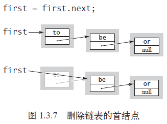
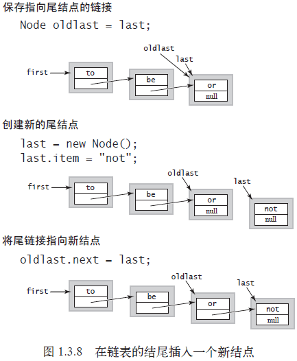
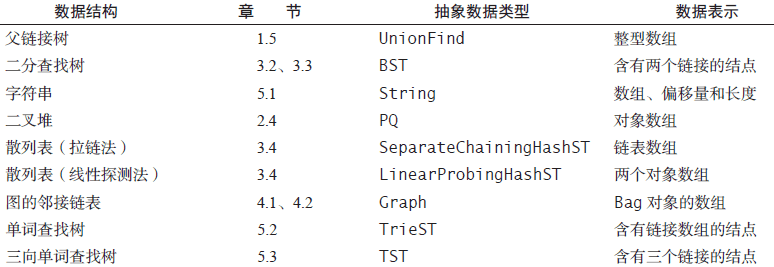

## 背包、队列和栈

### 链表  
* 链表是一种递归的数据结构，它或者为空(null)，或者是一个指向一个结点（node）的引用，该节点含有一个泛型的元素和一个指向另一条链表的引用。
#### 结点记录

- 使用嵌套类定义结点的抽象数据类型

  ```java
  private class Node
  {
  	Item item;
  	Node next;
  }
  ```

  - 该类没有其它任何方法，且会在代码中直接引用实例变量，这种类型的变量称为记录


#### 构造链表

- 需要一个Node类型的变量，保证它的值是null或者指向另一个Node对象的next域指向了另一个链表
- 如下图
  
- 链表表示的是一列元素
- 链式结构在本书中的可视化表示
  长方形表示对象；实例变量的值写在长方形中；用指向被引用对象的箭头表示引用关系
- 术语**链接**表示对结点的引用

#### 在表头插入结点

- 在首结点为first 的给定链表开头插入字符串not，我们先将first 保存在oldfirst 中，
  然后将一个新结点赋予first，并将它的item 域设为not，next 域设为oldfirst

- 时间复杂度为O(1)

- 如图
  

  

#### 从表头删除结点

- 将first指向first.next

- 原先的结点称为孤儿，Java的内存管理系统最终将回收它所占用的内存

- 如图
  

  

#### 在表尾插入结点

- 每个修改链表的操作都需要增加检查是否要修改该变量（以及做出相应修改）的代码

- 例如，当删除链表首结点时可能改变指向链表的尾结点的引用，因为链表中只有一个结点时它既是首结点又是尾结点

- 如图
  

  

#### 其他位置的插入和删除操作

删除指定结点；在指定节点插入新结点

- 需要将链表尾结点的前一个节点中的链接（它指向的是last）值改为null
- 为了找到指向last的结点，需要遍历链表，时间复杂度为O(n)
- 实现任意插入和删除操作的标准解决方案是**双向链表**

#### 遍历

- 将x初始化为链表首结点，然后通过x.item访问和x相关联的元素，并将x设为x.next来访问链表中的下一个结点，知道x=null(没有下一个结点了，到达链表结尾)

  ```java
  for (Node x = first; x != null; x = x.next)
  {
  // 处理x.item
  }
  ```

#### 栈的实现

- 使用链表实现栈

- 将栈保存为一条链表，栈的顶部即为表头，实例变量first 指向栈顶。这样，当使用push() 压入一个元素时，我们会按照1.3.3.3 节所讨论的代码将该元素添加在表头；当使用pop() 删除一个元素时，我们会按照1.3.3.4 节讨论的代码将该元素从表头删除。要实现size() 方法，我们用实例变量N 保存元素的个数，在压入元素时将N 加1，在弹出元素时将N 减1。要实现isEmpty() 方法，只需检查first 是否为null（或者可以检查N 是否为0）  

- 实现上述几个操作的时间复杂度为O(1)

- 下压堆栈（链表的实现）

  ```java
  public class Stack<Item> implements Iterable<Item>
  {
  	private Node first;
  	// 栈顶（最近添加的元素）
  	private int N;
  	// 元素数量
  	private class Node
  	{
  		// 定义了结点的嵌套类
  		Item item;
  		Node next;
  	}
  	public Boolean isEmpty() {
  		return first == null;
  	}
  	// 或：N == 0
  	public int size() {
  		return N;
  	}
  	public void push(Item item)
  	{
  		// 向栈顶添加元素
  		Node oldfirst = first;
  		first = new Node();
  		first.item = item;
  		first.next = oldfirst;
  		N++;
  	}
  	public Item pop()
  	{
  		// 从栈顶删除元素
  		Item item = first.item;
  		first = first.next;
  		N--;
  		return item;
  	}
  	// iterator() 的实现请见算法1.4
  	// 测试用例main() 的实现请见本节前面部分
  }
  ```

- 测试用例(pop()之前测试用例做了判断)

  ```java
  public static void main(String[] args)
  {
  	// 创建一个栈并根据StdIn中的指示压入或弹出字符串
  	Stack<String> s = new Stack<String>();
  	while (!StdIn.isEmpty())
  	{
  		String item = StdIn.readString();
  		if (!item.equals("-"))
  		s.push(item); else if (!s.isEmpty()) StdOut.print(s.pop() + " ");
  	}
  	StdOut.println("(" + s.size() + " left on stack)");
  }
  
  ```

  
  

#### 队列的实现

- 这里维护了first和last两个变量

- Queue实现使用的数据结构和Stack都是链表，但实现了不同的添加和删除元素的算法，所以前者是先入先出，后者是后进先出

- Queue的测试用例

  ```java
  public static void main(String[] args)
  {
  	// 创建一个队列并操作字符串入列或出列
  	Queue<String> q = new Queue<String>();
  	while (!StdIn.isEmpty())
  	{
  		String item = StdIn.readString();
  		if (!item.equals("-"))
  		q.enqueue(item); else if (!q.isEmpty()) StdOut.print(q.dequeue() + " ");
  	}
  	StdOut.println("(" + q.size() + " left on queue)");
  }
  ```

- Queue的测试用例

  ```java
  public static void main(String[] args)
  {
  	// 创建一个队列并操作字符串入列或出列
  	Queue<String> q = new Queue<String>();
  	while (!StdIn.isEmpty())
  	{
  		String item = StdIn.readString();
  		if (!item.equals("-"))
  		q.enqueue(item); else if (!q.isEmpty()) StdOut.print(q.dequeue() + " ");
  	}
  	StdOut.println("(" + q.size() + " left on queue)");
  }
  ```

- Queue的实现

  - 如下，enqueue()需要额外考虑first，dequeue()需要额外考虑last
    - 如果原队列没有结点，那么增加后last指向了新的元素，应该把first也指向新元素
    - 如果原对队列只有一个元素，那么删除后first确实指向null，而last没有更新，所以需要下面的判断手动更新

  ```java
  public class Queue<Item> implements Iterable<Item>
  {
  	private Node first;
  	// 指向最早添加的结点的链接
  	private Node last;
  	// 指向最近添加的结点的链接
  	private int N;
  	// 队列中的元素数量
  	private class Node
  	{
  		// 定义了结点的嵌套类
  		Item item;
  		Node next;
  	}
  	public Boolean isEmpty() {
  		return first == null;
  	}
  	// 或： N == 0.
  	public int size() {
  		return N;
  	}
  	public void enqueue(Item item)
  	{
  		// 向表尾添加元素
  		Node oldlast = last;
  		last = new Node();
  		last.item = item;
  		last.next = null;
  		if (isEmpty()) first = last; else oldlast.next = last;
  		N++;
  	}
  	public Item dequeue()
  	{
  		// 从表头删除元素
  		Item item = first.item;
  		first = first.next;
  		if (isEmpty()) last = null;
  		N--;
  		return item;
  	}
  	// iterator() 的实现请见算法1.4
  	// 测试用例main() 的实现请见前面
  }
  ```

- 在结构化数据集时，链表是数组的一种重要替代方法

#### 背包的实现

- 只需要将Stack中的push()改为add()即可，并去掉pop()

- 下面添加了Iterator实现类，以及iterator()具体方法
  其中，嵌套类ListIterator 维护了一个实例变量current来记录链表的当前结点。hasNext() 方法会检测current 是否为null，next() 方法会保存当前元素的引用，将current 变量指向链表中的下个结点并返回所保存的引用。

  ```java
  import java.util.Iterator;
  public class Bag<Item> implements Iterable<Item>
  {
  	private Node first;
  	// 链表的首结点
  	private class Node
  	{
  		Item item;
  		Node next;
  	}
  	public void add(Item item)
  	{
  		// 和Stack 的push() 方法完全相同
  		Node oldfirst = first;
  		first = new Node();
  		first.item = item;
  		first.next = oldfirst;
  	}
  	public Iterator<Item> iterator()
  	{
  		return new ListIterator();
  	}
  	private class ListIterator implements Iterator<Item>
  	{
  		private Node current = first;
  		public Boolean hasNext()
  		{
  			return current != null;
  		}
  		public void remove() {
  		}
  		public Item next()
  		{
  			Item item = current.item;
  			current = current.next;
  			return item;
  		}
  	}
  }
  ```

  
  

### 综述

- 学习了支持泛型和迭代的背包、队列和栈
- 现在拥有两种表示对象集合的方式，即数组和链表--->顺序存储和链式存储
  - 各种含有多个链接的数据结构，如二叉树的数据结构，由**含有两个链接的节点**组成
  - **复合型**的数据结构：背包存储栈，队列存储数组等，例如用数组的背包表示**图**

- 基础数据结构
  
- 研究新领域时，按以下步骤识别并使用数据抽象解决问题
  - 定义API
  - 根据应用场景开发**用例代码**
  - 描述数据结构（一组值的表示），并在API所对应的抽象数据类型的实现中根据它定义类的实例变量
  - 描述算法（实现一组操作的方式），实现类的实例方法
  - 分析算法的性能特点

- 本书的数据结构举例
  
  

### End

