## Service服务接口

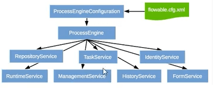

- 各个Service类
  RepositoryService 资源管理类，流程定义、部署、文件
  RuntimeService 流程运行管理类，运行过程中（执行）
  TaskService 任务管理类
  HistoryService 历史管理类
  ManagerService 引擎管理类

## Flowable图标

BPMN2.0定义的一些图标

- 时间

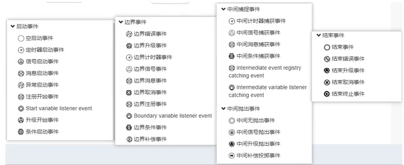

- 活动
  
- 网关
  
- 


## 流程部署深入解析

- 使用eclipse打包部署(没有eclipse环境，所以这里只有截图)
  将两个流程，打包为bar文件，然后放到项目resources文件夹中
  

- 这里是为了测试一次部署多个流程（定义，图）
  代码如下
  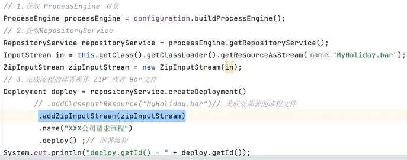

- 部署完成后查看表结构

  - act_re_procdef

    部署id一样
    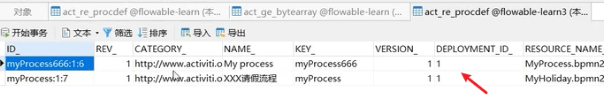

  - act_re_deployment
    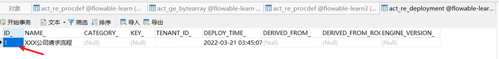

  - 结论：部署和定义是1对多的关系

- 每次部署所涉及到的资源文件
  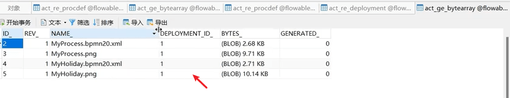

- 涉及到的三张表 

  - act_ge_bytearray
    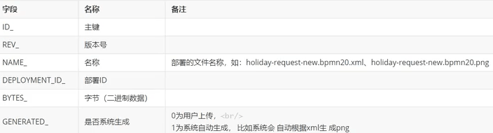

  - act_re_procdef
    category-->xml中的namespace
    name-->定义时起的名称
    key_--->xml中定义的id
    resource_name--->xml文件名称
    dgrm_resource_name-->生成图片名称
    suspension_state --> 是否被挂起

    tenant_id -- >谁部署的流程

  - act_re_deployment
    name_部署名

- 代码
  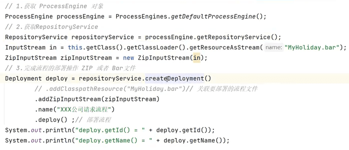

- 主要源码
  DeployCmd.class
  

- DeploymentEntityManagerImpl.java
  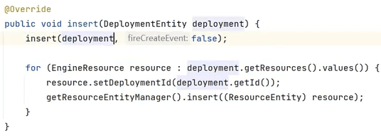

- insert()方法
  插入并执行资源
  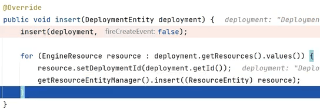
  点开里面的insert方法
  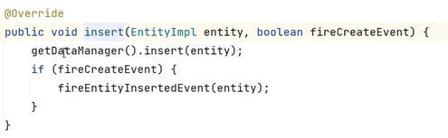

- AbstractDataManger.insert()
  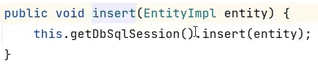

- 回到test类，deploy()方法最终就是完成了表结构的数据的操作（通过Mybatis）

## 流程的挂起和激活

- xml文件

  ```java
  <?xml version="1.0" encoding="UTF-8"?>
  <definitions xmlns="http://www.omg.org/spec/BPMN/20100524/MODEL"
               xmlns:xsi="http://www.w3.org/2001/XMLSchema-instance"
               xmlns:xsd="http://www.w3.org/2001/XMLSchema"
               xmlns:bpmndi="http://www.omg.org/spec/BPMN/20100524/DI"
               xmlns:omgdc="http://www.omg.org/spec/DD/20100524/DC"
               xmlns:omgdi="http://www.omg.org/spec/DD/20100524/DI"
               xmlns:flowable="http://flowable.org/bpmn"
               typeLanguage="http://www.w3.org/2001/XMLSchema"
               expressionLanguage="http://www.w3.org/1999/XPath"
               targetNamespace="http://www.flowable.org/processdef">
  
      <!--id process key-->
      <process id="holidayRequest" name="请假流程" isExecutable="true">
  
          <startEvent id="startEvent"/>
          <!--sequenceFlow表示的是线条箭头-->
          <sequenceFlow sourceRef="startEvent" targetRef="approveTask"/>
  
          <userTask id="approveTask" name="同意或者拒绝请假" flowable:assignee="zhangsan"/>
          <sequenceFlow sourceRef="approveTask" targetRef="decision"/>
  
          <!--网关-->
          <exclusiveGateway id="decision"/>
          <sequenceFlow sourceRef="decision" targetRef="externalSystemCall">
              <!--条件-->
              <conditionExpression xsi:type="tFormalExpression">
                  <![CDATA[
            ${approved}
          ]]>
              </conditionExpression>
          </sequenceFlow>
          <sequenceFlow  sourceRef="decision" targetRef="sendRejectionMail">
              <!--条件-->
              <conditionExpression xsi:type="tFormalExpression">
                  <![CDATA[
            ${!approved}
          ]]>
              </conditionExpression>
          </sequenceFlow>
  
          <serviceTask id="externalSystemCall" name="Enter holidays in external system"
                       flowable:class="org.flowable.CallExternalSystemDelegate"/>
          <sequenceFlow sourceRef="externalSystemCall" targetRef="holidayApprovedTask"/>
  
          <userTask id="holidayApprovedTask" name="Holiday approved" flowable:assignee="lisi"/>
          <sequenceFlow sourceRef="holidayApprovedTask" targetRef="approveEnd"/>
  
          <!--发送一个邮件-->
          <serviceTask id="sendRejectionMail" name="Send out rejection email"
                       flowable:class="org.flowable.SendRejectionMail"/>
          <sequenceFlow sourceRef="sendRejectionMail" targetRef="rejectEnd"/>
  
          <endEvent id="approveEnd"/>
  
          <endEvent id="rejectEnd"/>
  
      </process>
  
  </definitions>
  ```

  部署的流程默认情况下为激活，如果不想使用该定义的流程，那么可以挂起该流程，当然该流程定义下边所有的流程实例全部暂停。

- 流程定义被定义为挂起，该流程定义将不允许启动新的流程实例，且该流程定义下所有的流程实例将被全部挂起暂停执行

- 表结构
  act_re_procdef表中的SUSPENSION_STATE字段来表示1激活，2挂起

  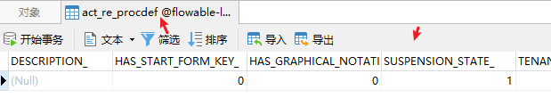

  

- 挂起流程

  ```java
  
      @Test
      public void testSuspend() {
          ProcessEngine engine = ProcessEngines.getDefaultProcessEngine();
          RepositoryService repositoryService = engine.getRepositoryService();
          //找到流程定义
          ProcessDefinition processDefinition = repositoryService.
                  createProcessDefinitionQuery().processDefinitionId("holidayRequest:1:7503")
                  .singleResult();
          //当前流程定义的状态
          boolean suspended = processDefinition.isSuspended();
          if (suspended) {
              //如果挂起则激活
              System.out.println("激活流程(定义)" + processDefinition.getId() + "name:" + processDefinition
                      .getName());
              repositoryService.activateProcessDefinitionById(processDefinition.getId());
          } else {
              //如果激活则挂起
              System.out.println("挂起流程(定义)" + processDefinition.getId() + "name:" + processDefinition
                      .getName());
              repositoryService.suspendProcessDefinitionById(processDefinition.getId());
          }
  
      }
  ```

  

  执行后
  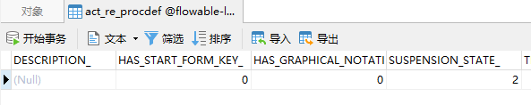

- 如果这时启动流程

  ```java
  
      /**
       * 流程运行
       */
      @Test
      public void testRunProcess() {
          ProcessEngine processEngine = ProcessEngines.getDefaultProcessEngine();//configuration.buildProcessEngine();
          RuntimeService runtimeService = processEngine.getRuntimeService();
          //这边模拟表单数据(表单数据有多种处理方式，这只是其中一种)
          Map<String, Object> map = new HashMap<>();
          map.put("employee", "张三");
          map.put("nrOfHolidays", 3);
          map.put("description", "工作累了想出去玩");
          ProcessInstance holidayRequest = runtimeService.startProcessInstanceByKey(
                  "holidayRequest", map);
          System.out.println("流程定义的id:" + holidayRequest.getProcessDefinitionId());
          System.out.println("当前活跃id:" + holidayRequest.getActivityId());
          System.out.println("流程运行id:" + holidayRequest.getId());
      }
  ```

  则会出现异常报错信息

  ```shell
  org.flowable.common.engine.api.FlowableException: Cannot start process instance. Process definition 请假流程 (id = holidayRequest:1:7503) is suspended
  ```

- 此时再运行一次testSuspend()，将流程定义激活，此时数据库act_re_procdef表中的SUSPENSION_STATE字段值为1
  再运行testRunProcess()，流程正常启动
  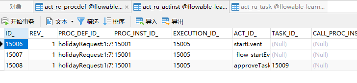

  

## 启动流程的原理

- 流程启动

  ```java
  
      /**
       * 流程运行
       */
      @Test
      public void testRunProcess() {
          ProcessEngine processEngine = ProcessEngines.getDefaultProcessEngine();//configuration.buildProcessEngine();
          RepositoryService repositoryService = processEngine.getRepositoryService();
          Deployment deploy = repositoryService.createDeployment()
                  .addClasspathResource("holiday-request.bpmn20.xml")
                  .name("ly05150817部署的请假流程")
                  .deploy();
          //通过部署id查找流程定义
          ProcessDefinition processDefinition = repositoryService.createProcessDefinitionQuery().
                  deploymentId(deploy.getId())
                  .singleResult();
  
          RuntimeService runtimeService = processEngine.getRuntimeService();
          //这边模拟表单数据(表单数据有多种处理方式，这只是其中一种)
          Map<String, Object> map = new HashMap<>();
          map.put("employee", "张三");
          map.put("nrOfHolidays", 3);
          map.put("description", "工作累了想出去玩");
          ProcessInstance holidayRequest = runtimeService.startProcessInstanceById(
                  processDefinition.getId(), "order1000", map);
          System.out.println("流程定义的id:" + holidayRequest.getProcessDefinitionId());
          System.out.println("当前活跃id:" + holidayRequest.getActivityId());
          System.out.println("流程运行id:" + holidayRequest.getId());
      }
  ```

- 涉及到的表：(HI中也有对应的表)

  - ACT_RU_EXECUTION 运行时流程执行实例
    当启动一个实例的时候，这里会有两个流程执行

    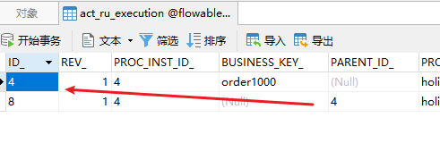

  - ACT_RU_IDENTITYLINK  运行时用户关系信息

    - 记录流程实例当前所处的节点
    - 数据库表
      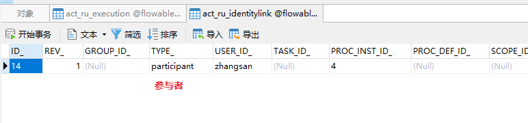

    - 有几种任务处理人的类型

      ```java
      public class IdentityLinkType {
      
          public static final String ASSIGNEE = "assignee"; //指派
      
          public static final String CANDIDATE = "candidate";//候选
      
          public static final String OWNER = "owner";//拥有者
      
          public static final String STARTER = "starter";//启动者
      
          public static final String PARTICIPANT = "participant";//参与者
      
          public static final String REACTIVATOR = "reactivator";
      }
      ```

      

  - ACT_RU_TASK 运行时任务表
    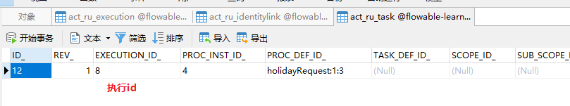

  - ACT_RU_VARIABLE 运行时变量表

    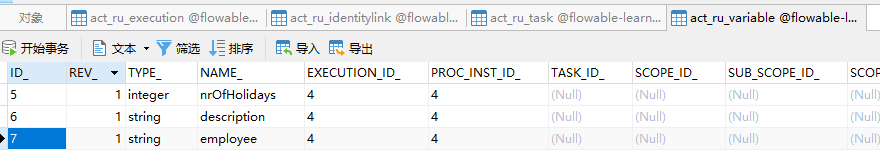

  

## 处理流程的原理

- 流程处理

  ```java
  
      @Test
      public void testCompleted(){
          ProcessEngine processEngine=ProcessEngines.getDefaultProcessEngine();
          TaskService taskService = processEngine.getTaskService();
          Task task = taskService.createTaskQuery()
                  .processInstanceId("4")
                  .taskAssignee("zhangsan")
                  .singleResult();
          //获取当前流程实例绑定的流程变量
          Map<String, Object> processVariables = task.getProcessVariables();
          Set<String> keySet = processVariables.keySet();
          for(String key:keySet){
              Object o = processVariables.get(key);
              System.out.println("key:"+key+"--value:"+o);
          }
  
          processVariables.put("approved",true);//同意
          processVariables.put("description","我被修改了");
          taskService.complete(task.getId(),processVariables);
  
      }
  ```

- 这里用的是之前的xml，所以应该给一个服务监听类

  ```java
  public class CallExternalSystemDelegate implements JavaDelegate {
      @Override
      public void execute(DelegateExecution execution) {
          System.out.println("您的请求通过了！");
      }
  }
  ```

- 任务处理后，这里添加了一个变量，且修改了变量description
  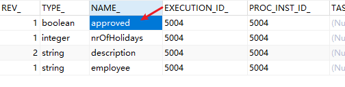
  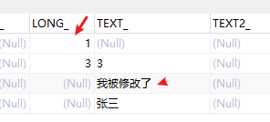

  - 可以通过流程变量，它可以在整个流程过程中流转的[注意，这里流程结束后流程变量会不存在的，但是act_hi_variinst里面可以看到流程变量实例]
    //我感觉应该用表单替代

- act_ru_task和act_ru_identitylink

  - 两者区别
    - **ACT _ RU _ IDENTITYLINK**：此表存储有关用户或组的数据及其与（流程/案例/等）实例相关的角色。该表也被其他需要身份链接的引擎使用。【显示全部，包括已完成】
    - **ACT _ RU _ TASK**：此表包含一个正在运行的实例的每个未完成用户任务的条目。然后在查询用户的任务列表时使用此表。【这里只显示运行中】
  - act_ru_task
    记录当前实例所运行的当前节点的信息
    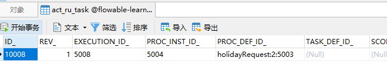
  - act_ru_identitylink
    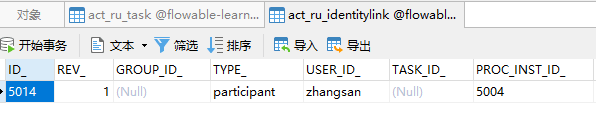

- act_ru_execution这个表的数据不会有变动
  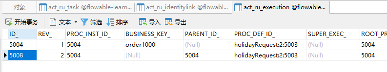

## 流程结束的原理

- 流程走完

  ```java
  
      @Test
      public void testCompleted1() {
          ProcessEngine processEngine = ProcessEngines.getDefaultProcessEngine();
          TaskService taskService = processEngine.getTaskService();
          Task task = taskService.createTaskQuery()
                  .processInstanceId("4")
                  .taskAssignee("lisi")
                  .singleResult();
          //获取当前流程实例绑定的流程变量
          Map<String, Object> processVariables = task.getProcessVariables();
          Set<String> keySet = processVariables.keySet();
          for (String key : keySet) {
              Object o = processVariables.get(key);
              System.out.println("key:" + key + "--value:" + o);
          }
  /*
              processVariables.put("approved",true);//拒绝
              processVariables.put("description","我被修改了");*/
          taskService.complete(task.getId(), processVariables);
  
      }
  ```

- 此时跟流程相关的数据都会被清空掉
  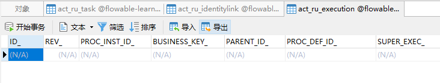

- 历史数据

  - 变量
    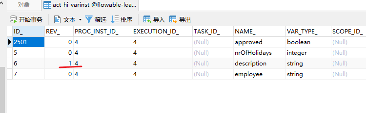

  - 任务流转历史
    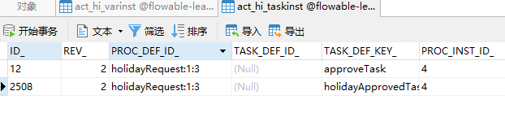

  - 流程实例
    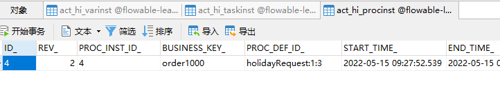

  - 涉及到的用户
    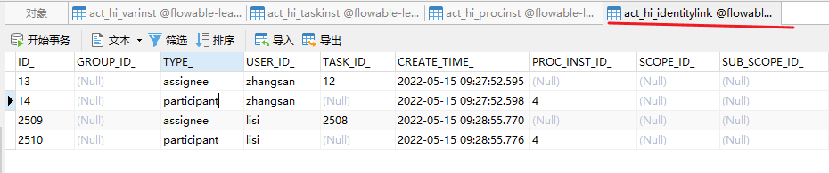

  - 流程活动

    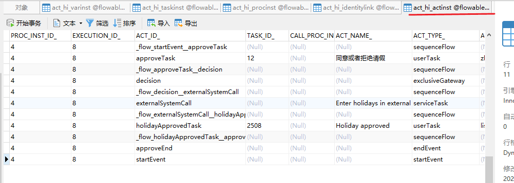

  - 


