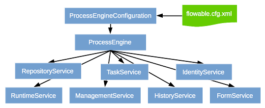

### 流程引擎API和服务

引擎API是与Flowable交互的常见方式，主要起点是ProcessEngine，可以通过配置（Configuration章节）中描述的多种方式创建。

从ProcessEngine获取包含工作流/BPM方法的各种服务。ProcessEngine和服务对象是线程安全的



下面是通过processEngine获取各种服务的方法

```java
ProcessEngine processEngine = ProcessEngines.getDefaultProcessEngine();

RuntimeService runtimeService = processEngine.getRuntimeService();
RepositoryService repositoryService = processEngine.getRepositoryService();
TaskService taskService = processEngine.getTaskService();
ManagementService managementService = processEngine.getManagementService();
IdentityService identityService = processEngine.getIdentityService();
HistoryService historyService = processEngine.getHistoryService();
FormService formService = processEngine.getFormService();
DynamicBpmnService dynamicBpmnService = processEngine.getDynamicBpmnService();
```

ProcessEngines.getDefaultProcessEngine()在第一次调用时初始化并构建流程引擎，然后返回相同的流程引擎

ProcessEngines类将扫描所有flowable.cfg.xml和flowable-context.xml文件。

> 对于所有 flowable.cfg.xml 文件，流程引擎将以典型的 Flowable 方式构建：ProcessEngineConfiguration.createProcessEngineConfigurationFromInputStream(inputStream).buildProcessEngine()。
>
> 对于所有 flowable-context.xml 文件，流程引擎将以 Spring 方式构建：首先创建 Spring 应用程序上下文，然后从该应用程序上下文中获取流程引擎。

> The **RepositoryService** is probably the first service needed when working with the Flowable engine.

该服务**(RepositoryService)**提供用于管理和操作部署**deployments**和流程定义的操作

- 查询引擎已知的部署和流程定义
- 暂停和激活作为一个整体或特定流程定义的部署。挂起意味着不能对它们执行进一步的操作，而激活则相反并再次启用操作
- 检索各种资源，例如引擎自动生成的部署或流程图中包含的文件
- 检索流程定义的 POJO 版本，该版本可用于使用 Java 而不是 XML 来内省流程

RepositoryService主要是关于静态信息（不会改变的数据，或者至少不会改变太多），而RuntimeService处理启动流程定义的*新流程实例* 

- 流程定义定义了流程中不同步骤的结构和行为，流程实例是此类流程定义的一次执行

- 对于每个流程定义，通常有许多实例同时运行

- Runtime也用于检索和存储**流程变量**

- Runtimeservice还可以用来查询流程实例和执行(executions)

  > Executions are a representation of the 'token' concept of BPMN 2.0.
  > 执行是指向流程实例当前所在位置的指针

- 只要流程实例正在等待外部触发器并且流程需要继续，就会使用 RuntimeService

- 流程实例可以有各种等待状态，并且该服务包含各种操作以向实例发出“信号”，即接收到外部触发器并且流程实例可以继续

需要由系统的人类用户执行的任务是BPM引擎（如Floable）的核心，围绕任务的所有内容都在TaskService中进行分组

- 查询分配给用户或组的任务
- 创建新的独立任务（与流程实例无关）
- 任务被分配给哪个用户或哪些用户，以及让这些用户以某种方式参与该任务
- 要求并完成一项任务，声明意味着某人决定成为该任务的受让人**assignee** 

IdentityService支持组和用户的管理（创建、更新、删除、查询）

FormService是可选服务，引入了启动表单（**start form**）和任务表单(**a task form**)的概念

> **HistoryService**公开了 Flowable 引擎收集的所有历史数据。在执行流程时，引擎可以保留很多数据（这是可配置的），例如流程实例的启动时间，谁做了哪些任务，完成任务花了多长时间，每个流程实例中遵循的路径，等等。

使用Flowable 编写自定义应用程序时，通常不需要**ManagementService 。**它允许检索有关数据库表和表元数据的信息。此外，它还公开了作业的查询功能和管理操作

**DynamicBpmnService**可用于更改流程定义的一部分，而无需重新部署它。例如，您可以更改流程定义中用户任务的受理人定义，或更改服务任务的类名。

### 异常策略

Flowable 中的基本异常是 org.flowable.engine.FlowableException

Flowable的一些异常子类

- FlowableWrongDbException：当 Flowable 引擎发现数据库架构版本和引擎版本不匹配时抛出。
- FlowableOptimisticLockingException：当并发访问同一数据条目导致数据存储发生乐观锁定时抛出。
- FlowableClassLoadingException：当请求加载的类未找到或加载时发生错误时抛出（例如 JavaDelegates、TaskListeners ......）。
- FlowableObjectNotFoundException：当请求或操作的对象不存在时抛出。
- FlowableIllegalArgumentException：异常表明在 Flowable API 调用中提供了非法参数，在引擎配置中配置了非法值，或者提供了非法值，或者在流程定义中使用了非法值。
- FlowableTaskAlreadyClaimedException：当任务已被声明时抛出，当 taskService.claim(...) 被调用时

### 查询接口

引擎查询数据有两种方式：the query API and native queries

- queryAPi允许使用fluent API编写完全类型安全的查询，例如

  ```java
  List<Task> tasks = taskService.createTaskQuery()
      .taskAssignee("kermit")
      .processVariableValueEquals("orderId", "0815")
      .orderByDueDate().asc()
      .list();
  ```

- native queries
  （返回类型由您使用的查询对象定义，数据映射到正确的对象[比如任务、流程实例、执行等，且您必须使用在数据库中定义的表明和列名]）。如下，可以通过api检索表名等，使依赖关系尽可能小

  ```java
  List<Task> tasks = taskService.createNativeTaskQuery()
    .sql("SELECT count(*) FROM " + managementService.getTableName(Task.class) +
        " T WHERE T.NAME_ = #{taskName}")
    .parameter("taskName", "gonzoTask")
    .list();
  
  long count = taskService.createNativeTaskQuery()
    .sql("SELECT count(*) FROM " + managementService.getTableName(Task.class) + " T1, " +
        managementService.getTableName(VariableInstanceEntity.class) + " V1 WHERE V1.TASK_ID_ = T1.ID_")
    .count();
  ```

### 变量

- 每个流程实例都需要并使用数据来执行其组成的步骤。在 Flowable 中，这些数据称为*变量*，存储在数据库中

- 流程实例可以有变量（称为*流程变量*），也可以有*执*行（指向流程处于活动状态的特定指针）。用户任务也可以有变量，变量存储在ACT_RU_VARIABLE数据库表中

- 所有*startProcessInstanceXXX*方法都有一个可选参数，用于在创建和启动流程实例时提供变量

  ```java
  ProcessInstance startProcessInstanceByKey(String processDefinitionKey, Map<String, Object> variables);
  
  ```

- 可以在流程执行期间添加变量。例如，（*RuntimeService*）

  ```java
  void setVariable(String executionId, String variableName, Object value);
  void setVariableLocal(String executionId, String variableName, Object value);
  void setVariables(String executionId, Map<String, ? extends Object> variables);
  void setVariablesLocal(String executionId, Map<String, ? extends Object> variables);
  ```

- 检索变量
  *TaskService*上存在类似的方法。这意味着任务（如执行）可以具有仅在任务期间“活动”的局部变量

  ```java
  Map<String, Object> getVariables(String executionId);
  Map<String, Object> getVariablesLocal(String executionId);
  Map<String, Object> getVariables(String executionId, Collection<String> variableNames);
  Map<String, Object> getVariablesLocal(String executionId, Collection<String> variableNames);
  Object getVariable(String executionId, String variableName);
  <T> T getVariable(String executionId, String variableName, Class<T> variableClass);
  ```

- 当前***执行***或***任务***对象是可用的，它可以用于变量设置和/或检索

  ```java
  execution.getVariables();
  execution.getVariables(Collection<String> variableNames);
  execution.getVariable(String variableName);
  
  execution.setVariables(Map<String, object> variables);
  execution.setVariable(String variableName, Object value);
  ```

  - **在执行上述任何调用时，所有**变量都会在后台从数据库中获取。这意味着，如果您有 10 个变量，但只能通过*getVariable("myVariable")*获得一个，那么在幕后将获取并缓存其他 9 个

  - 接上述，可以设置是否缓存所有变量

    ```java
    Map<String, Object> getVariables(Collection<String> variableNames, boolean fetchAllVariables);
    Object getVariable(String variableName, boolean fetchAllVariables);
    void setVariable(String variableName, Object value, boolean fetchAllVariables);
    ```

### 瞬态变量

瞬态变量是行为类似于常规变量但不持久的变量。通常，瞬态变量用于高级用例

- 对于瞬态变量，根本没有存储历史记录。
- 与*常规*变量一样，瞬态变量在设置时放在*最高父*级。这意味着在执行时设置变量时，瞬态变量实际上存储在流程实例执行中。与常规变量一样，如果在特定执行或任务上设置变量，则存在方法的*局部变体。*
- 只能在流程定义中的下一个“等待状态”之前访问瞬态变量。在那之后，他们就走了。在这里，等待状态是指流程实例中它被持久化到数据存储中的点。请注意，在此定义中，*异步*活动也是“等待状态”！
- 瞬态变量只能由*setTransientVariable(name, value)*设置，但调用*getVariable(name)*时也会返回瞬态变量（也存在一个*getTransientVariable(name)*，它只检查瞬态变量）。这样做的原因是使表达式的编写变得容易，并且使用变量的现有逻辑适用于这两种类型。
- 瞬态变量会*隐藏*同名的持久变量。这意味着当在流程实例上同时设置持久变量和瞬态变量并*调用 getVariable("someVariable")*时，将返回瞬态变量值。

可以在大多数地方设置和获取瞬态变量

- 关于*JavaDelegate*实现中的*DelegateExecution*

- 关于*ExecutionListener*实现中的DelegateExecution*和*关于*TaskListener*实现的*DelegateTask*

- *通过执行*对象在脚本任务中

- 通过运行时服务启动流程实例时

- 完成任务时

- 调用*runtimeService.trigger*方法时

- 方法

  ```java
  void setTransientVariable(String variableName, Object variableValue);
  void setTransientVariableLocal(String variableName, Object variableValue);
  void setTransientVariables(Map<String, Object> transientVariables);
  void setTransientVariablesLocal(Map<String, Object> transientVariables);
  
  Object getTransientVariable(String variableName);
  Object getTransientVariableLocal(String variableName);
  
  Map<String, Object> getTransientVariables();
  Map<String, Object> getTransientVariablesLocal();
  
  void removeTransientVariable(String variableName);
  void removeTransientVariableLocal(String variableName);
  ```

- 典型示例
  

- 瞬态变量传递

  ```java
  ProcessInstance processInstance = runtimeService.createProcessInstanceBuilder()
         .processDefinitionKey("someKey")
         .transientVariable("configParam01", "A")
         .transientVariable("configParam02", "B")
         .transientVariable("configParam03", "C")
         .start();
  ```

  - 获取数据

    ```java
    public static class FetchDataServiceTask implements JavaDelegate {
      public void execute(DelegateExecution execution) {
        String configParam01 = (String) execution.getVariable(configParam01);
        // ...
    
        RestResponse restResponse = executeRestCall();
        execution.setTransientVariable("response", restResponse.getBody());
        execution.setTransientVariable("status", restResponse.getStatus());
      }
    }
    ```

  - 离开独占网关的序列流的条件不知道使用的是持久变量还是瞬态变量（在本例中为*状态*瞬态变量）：

    ```xml
    <conditionExpression xsi:type="tFormalExpression">${status == 200}</conditionExpression>
    ```

  

### 表达式

Flowable使用UEL进行表达式解析，UEL代表统一表达式语言，是EE6规范的一部分。两种类型的表达式（值表达式和方法表达式），都可以在需要表达式的地方使用

- 值表达式，解析为一个值

  ```xml
  ${myVar}
  ${myBean.myProperty}
  ```

- 方法表达式：调用带或不带参数的方法

  ```xml
  ${printer.print()}
  ${myBean.addNewOrder('orderName')}
  ${myBean.doSomething(myVar, execution)}
  ```

### 表达式函数

一些开箱即用的函数

- **variables:get(varName)**：检索变量的值。与直接在表达式中写变量名的主要区别在于，当变量不存在时，使用这个函数不会抛出异常。例如，如果*myVariable*不存在，*${myVariable == "hello"}*会抛出异常，但*${var:get(myVariable) == 'hello'}*会正常工作。
- **variables:getOrDefault(varName, defaultValue)**：类似于*get*，但可以选择提供默认值，当变量未设置或值为*null*时返回。
- **variables:exists(varName)** ：如果变量具有非空值，则返回*true 。*
- **variables:isEmpty(varName)** (alias *:empty* ) : 检查变量值是否不为空。根据变量类型，行为如下：
  - 对于字符串变量，如果变量是空字符串，则认为该变量为空。
  - 对于 java.util.Collection 变量，如果集合没有元素，则返回*true 。*
  - 对于 ArrayNode 变量，如果没有元素则返回*true*
  - 如果变量为*null*，则始终返回*true*
- **variables:isNotEmpty(varName)** (alias *: notEmpty) :* *isEmpty*的逆运算。
- **variables:equals(varName, value)**（别名*:eq*）：检查变量是否等于给定值。这是表达式的简写函数，否则将被写为*${execution.getVariable("varName") != null && execution.getVariable("varName") == value}*。
  - 如果变量值为 null，则返回 false（除非与 null 比较）。
- **variables:notEquals(varName, value)**（别名*:ne ）：* *equals*的反向比较。
- **variables:contains(varName, value1, value2, ...)**：检查提供的**所有**值是否包含在变量中。根据变量类型，行为如下：
  - 对于字符串变量，传递的值用作需要成为变量一部分的子字符串
  - 对于 java.util.Collection 变量，所有传递的值都需要是集合的一个元素（正则*包含*语义）。
  - 对于 ArrayNode 变量：支持检查 arraynode 是否包含作为变量类型支持的类型的 JsonNode
  - 当变量值为 null 时，在所有情况下都返回 false。当变量值不为null，且实例类型不是上述类型之一时，会返回false。
- **variables:containsAny(varName, value1, value2, ...)**：类似于*contains*函数，但如果**任何**（而非全部）传递的值包含在变量中，则将返回*true 。*
- **variables:base64(varName)**：将二进制或字符串变量转换为 Base64 字符串
- 比较器功能：
  - **variables:lowerThan(varName, value)** (别名*:lessThan*或*:lt* ) : *${execution.getVariable("varName") != null && execution.getVariable("varName") < value}的简写*
  - **变量：lowerThanOrEquals(varName, value)**（别名*:lessThanOrEquals*或*:lte*）：类似，但现在用于*< =*
  - **variables:greaterThan(varName, value)** (alias *:gt* ) : 类似，但现在用于*>*
  - **variables:greaterThanOrEquals(varName, value)** (alias *:gte* ) : 类似，但现在用于*> =*
- 

### 单元测试

使用自定义资源进行单元测试

```java

@FlowableTest
public class MyBusinessProcessTest {
    private ProcessEngine processEngine;
    private RuntimeService runtimeService;
    private TaskService taskService;

    @BeforeEach
    void setUp(ProcessEngine processEngine) {
        this.processEngine = processEngine;
        this.runtimeService = processEngine.getRuntimeService();
        this.taskService = processEngine.getTaskService();
    }

    @Test
    @Deployment(resources = "holiday-request.bpmn20.xml")
    void testSimpleProcess() {
        HashMap<String, Object> employeeInfo = new HashMap<>();
        employeeInfo.put("employee", "wangwu1028930");
        //employeeInfo.put()
        runtimeService.startProcessInstanceByKey(
                "holidayRequest", employeeInfo
        );
        Task task = taskService.createTaskQuery().singleResult();
        assertEquals("Approve or reject request", task.getName());
        HashMap<String, Object> hashMap = new HashMap<>();
        hashMap.put("approved", true);
        taskService.complete(task.getId(), hashMap);
        assertEquals(1, runtimeService
                .createProcessInstanceQuery().count());
    }

}
```


### 调试单元测试

### Web应用程序中的流程引擎

编写一个简单的ServletContextListener来初始化和销毁普通Servlet环境中的流程引擎

```java
public class ProcessEnginesServletContextListener implements ServletContextListener {

  public void contextInitialized(ServletContextEvent servletContextEvent) {
    ProcessEngines.init();
  }

  public void contextDestroyed(ServletContextEvent servletContextEvent) {
    ProcessEngines.destroy();
  }

}
```


其中，ProcessEngines.init()将在类路径中查找flowable.cfg.xml资源文件，并为给定的配置创建一个ProcessEngine，使用下面两种方式来获取他

```java
ProcessEngines.getDefaultProcessEngine()
//或者下面的方式
ProcessEngines.getProcessEngine("myName");

```


