- 模型设计完后，下面三个表有变化

  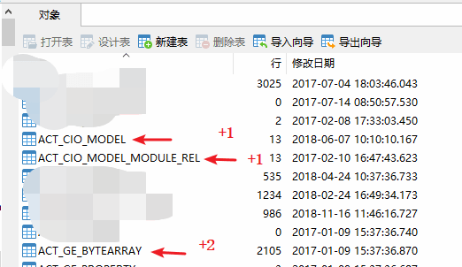

  - act_cio_model
    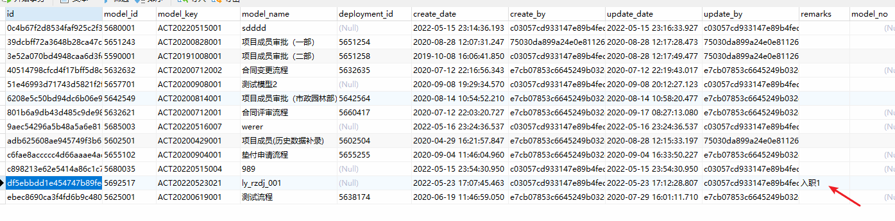
  - act_cio_model_module_rel
    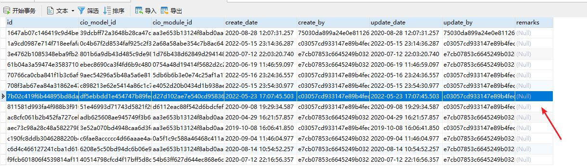
  - act_ge_bytearray
    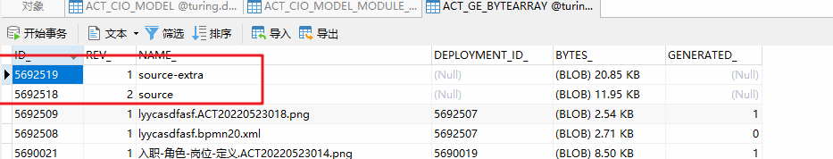

- 部署之后，四个表有变化
    

  - act_cio_deployment
    多了39条记录
    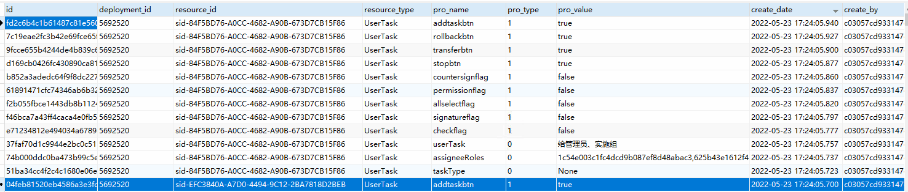

    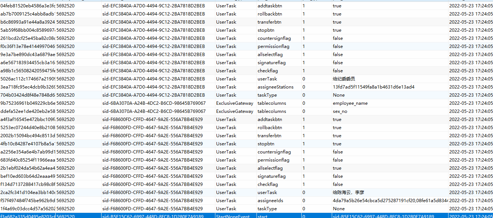

  - act_ge_bytearray
    多了两条记录
    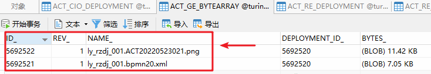

  - act_re_deployment
    多了一条记录
    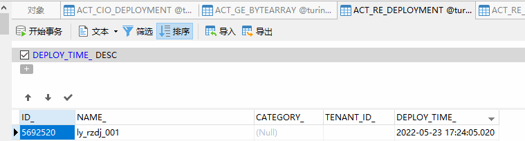

  - act_re_procdef
    多了一条记录
    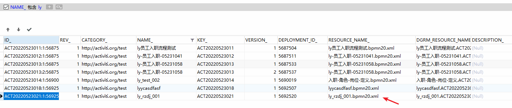

- 流程开始运行

  - 下面只写上主要的几个表
  - 送审时这个结点只能选一个
    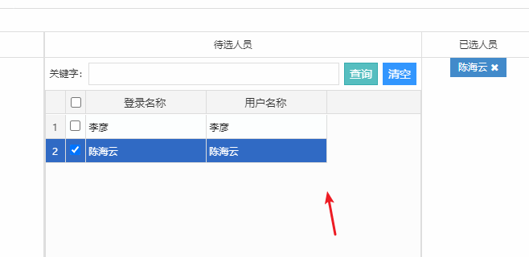
  - 流程运行时变量表
    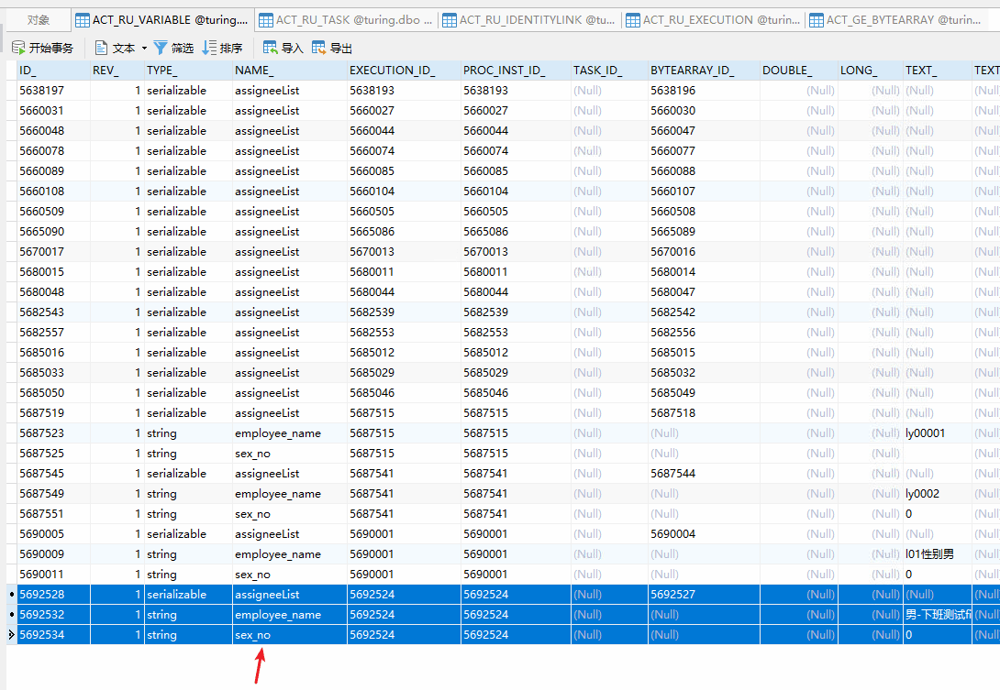
