> 系列视频地址介绍  
> https://www.youtube.com/watch?v=qtIqKaDlqXo&list=PLLAZ4kZ9dFpOnyRlyS-liKL5ReHDcj4G3

  

# 介绍
- hugo是用来构建静态网站的
- 但是也可以稍微做点动态生成的事
- 这里使用的版本是**v0.26**（很久之前的版本）
> 备注：标题**短代码**之前（不包括短代码这篇）的笔记是回溯的，所以没有复制源代码下来，直接在视频再次截图的
# 在Windows上安装hugo
- 到github release下载，然后放到某个文件夹中  
  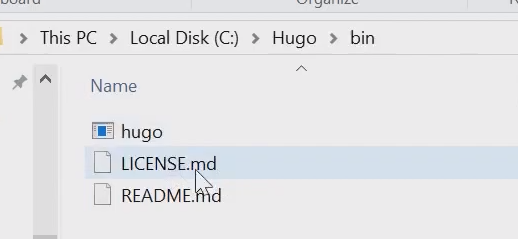
- 设置环境变量  
  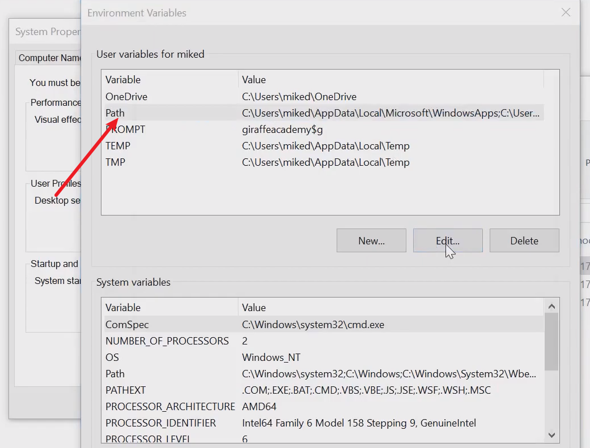
- 验证环境变量  
  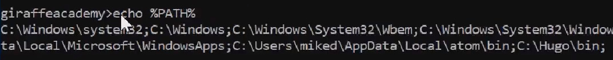
- 最后验证hugo版本  
``` shell
hugo version
```
# 创建一个新的网站
- 使用代码生成
```shell
hugo new site
```
- 文件夹结构  
  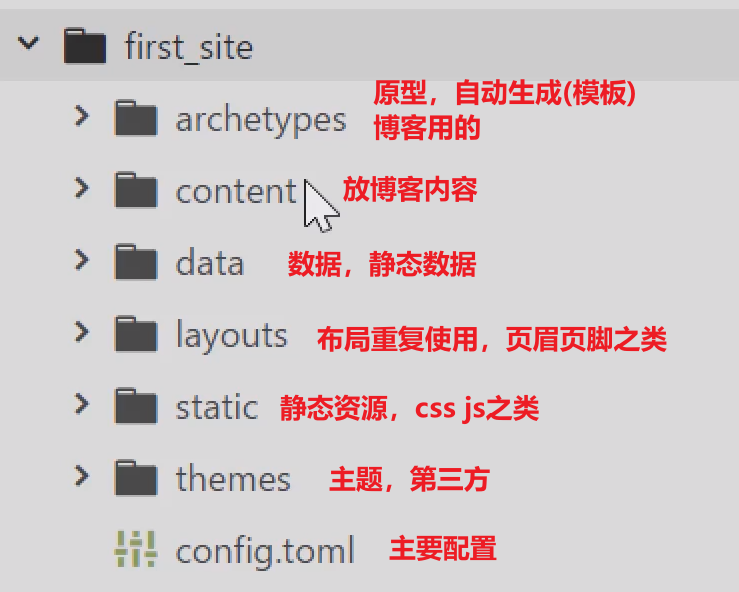
# 使用主题  
  这里是https://themes.gohugo.io  
  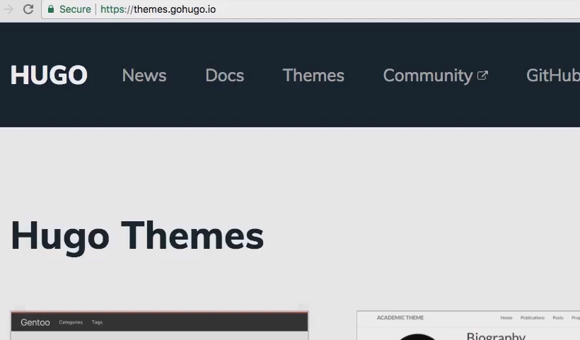  这里使用的是ga-hugo-theme（github中查找），并放到themes文件夹中  
  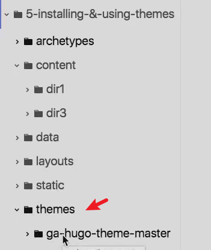  
  之后在config.toml中使用主题  
``` toml
baseURL = "http://example.org/"
languageCode = "en-us"
title = "My New Hugo Site"
theme = "ga-hugo-theme" #添加这句话
```
- 启动博客  
  ```hugo serve```
- 地址  
  ```localhost:1313```
# 创建md文件
- 使用```hugo new a.md```把文件创建在content/a.md或者```hugo new dir2/d.md```把文件创建在```content/dir2.md```下，这讲创建后的结构目录为  
  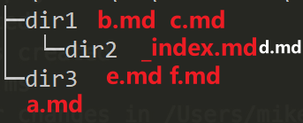  
  - 总共5个文件，可以使用localhost:1313访问博客（默认列举所有（包括子文件夹）文件
  - 可以使用 localhost:1313/dir3访问dir3下所有文件列表(list)，localhost:1313/dir1访问dir1下所有文件列表 （都是content的直接子文件夹）
  - 如果没有dir1/dir2/_index.md这个文件 ，则不能直接使用localhost:1313/dir1/dir2访问dir1/dir2下所有文件
  - 查看dir1/dir2/index.md文件及效果  
    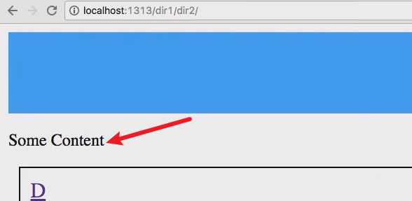  
# frontmatter (前言)
- 可以使用YAML，TOML，或者JSON
- md编码及效果  
  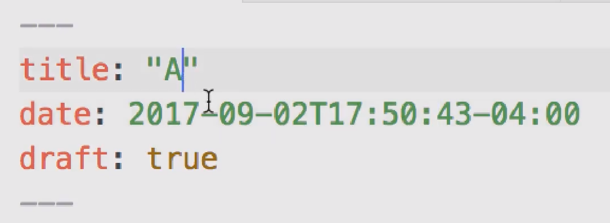  
    
# archetypes（原型）
## 默认的原型文件
 archetypes/default.md  
``` toml    
 
 ---
title: "{{ replace .TranslationBaseName "-" " " | title }}"
date: {{ .Date }}
draft: true
author: "Mike"
---  
 
```
 使用命令行```hugo new b.md```结果  
 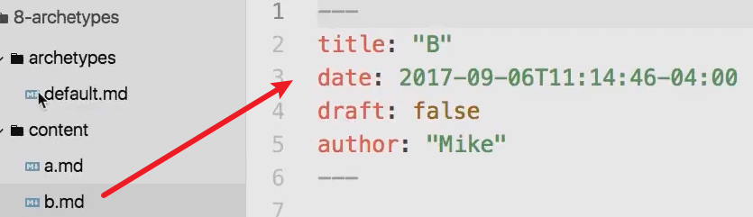  
  ## 和文件夹结构相关的原型文件  
  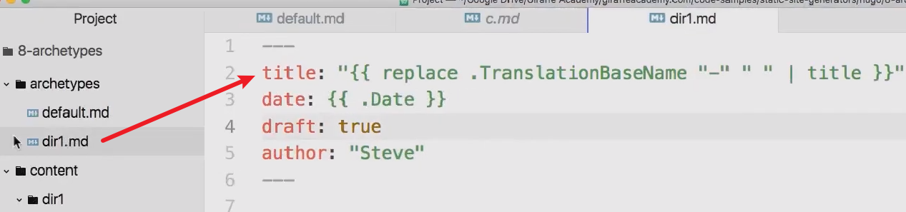  
  使用命令行```hugo new dir1/c.md```结果  
  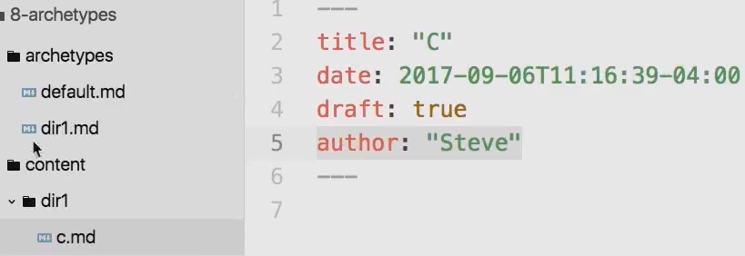  
  如果`hugo new dir1/c.md`时archetypes/dir1.md不存在，则才会去找```archetypes/default.md```当模板创建文件
# shortcodes 短代码
## 代码
放到markdown文件中（这个youtube是官方支持的内嵌的）
```markdown 
 
{{/*< youtube w7Ft2ymGmfc >*/}} 
 
```
## 效果  
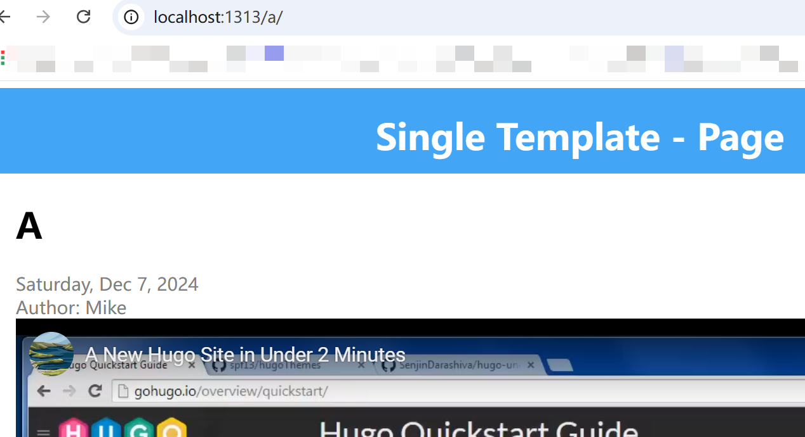  
# taxonomies（分类法）
## 默认的两个分类
比如修改了总共三个文件 （隐去其他前言数据） 
```yaml    
 
---
# a.md
title: "A" 
tags: ["tag1","tag2","tag3"]
categories: ["cat1"]
---
# b.md
---
title: "B"
tags: ["tag2" ]
categories: ["cat2"]
---
# c.md
---
title: "C"
tags: ["tag3"]
categories: ["cat2"]
---   
 
```
效果：  
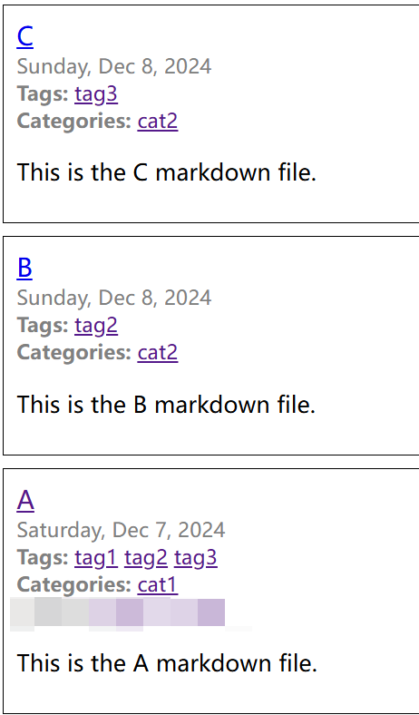  
点击tag2时效果  
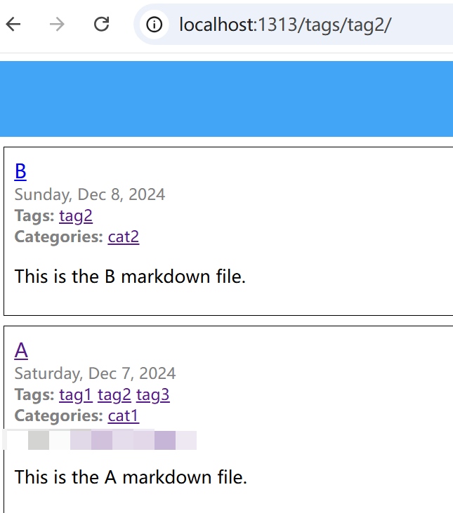  
点击cat1时的效果  
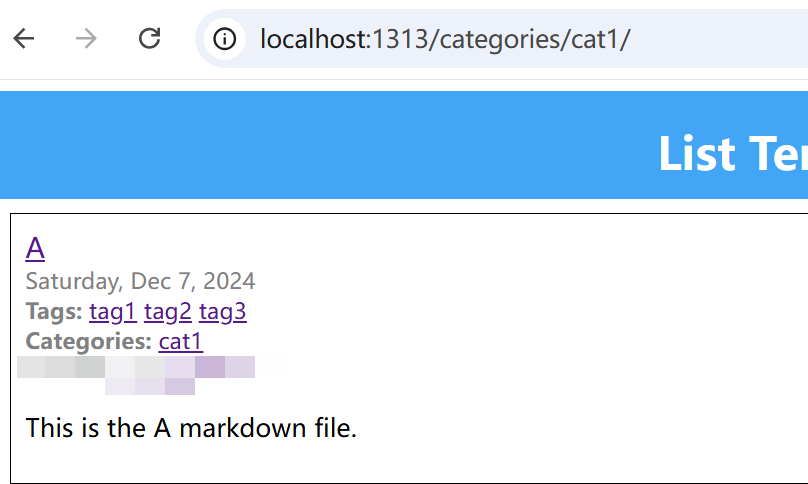
## 自定义分类
```yaml  
 
# a.md添加最后一行，最后代码（忽略其他属性）
---

title: "A

tags: ["tag1","tag2","tag3"]

categories: ["cat1"]

moods: ["Happy","Upbeat"]

---  
 
```
以及修改config.toml文件  
```toml  
 
baseURL = "http://example.org/"
languageCode = "en-us"
title = "My New Hugo Site"
theme = "ga-hugo-theme"
[taxonomies] #添加这行及以下三行
  tag = "tags"
  category = "categories"
  mood = "moods"  
 
```
效果：  
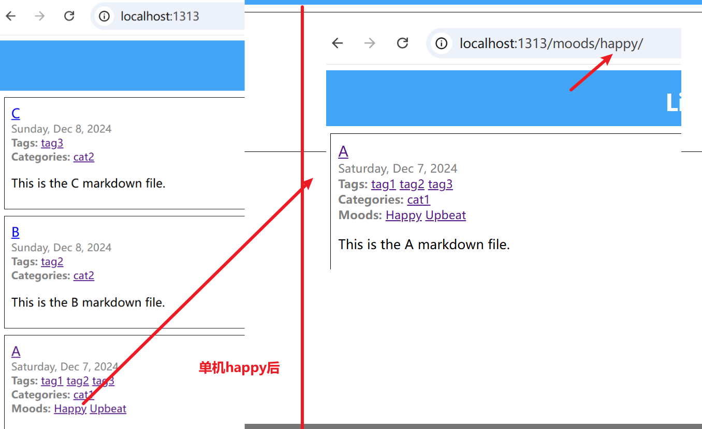      

