>这里使用的版本是**v0.26**（很久之前的版本）

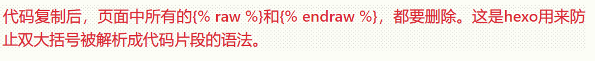  

# template basic
模板分为list template和single template  
## 文件夹结构
content目录结构  
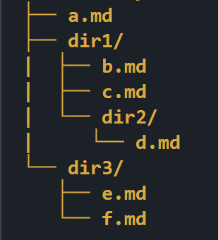
## list template （列表模板）  
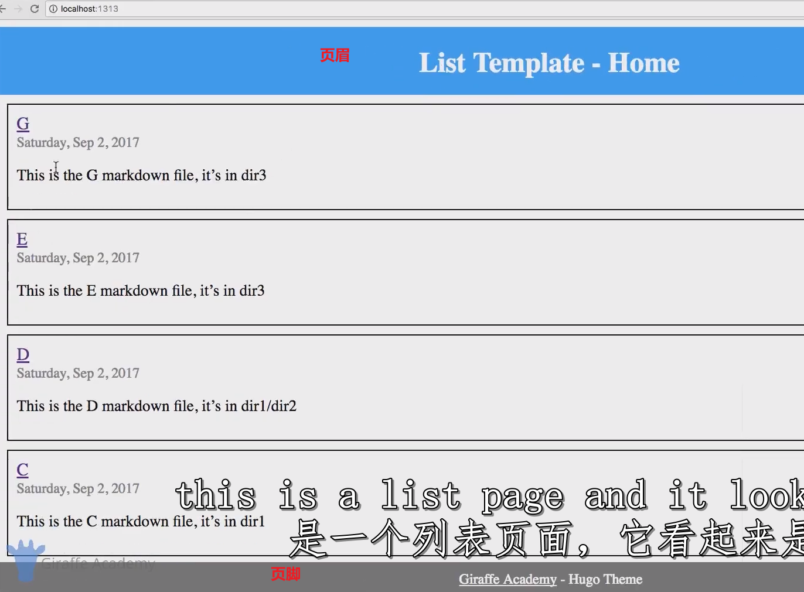  
  
  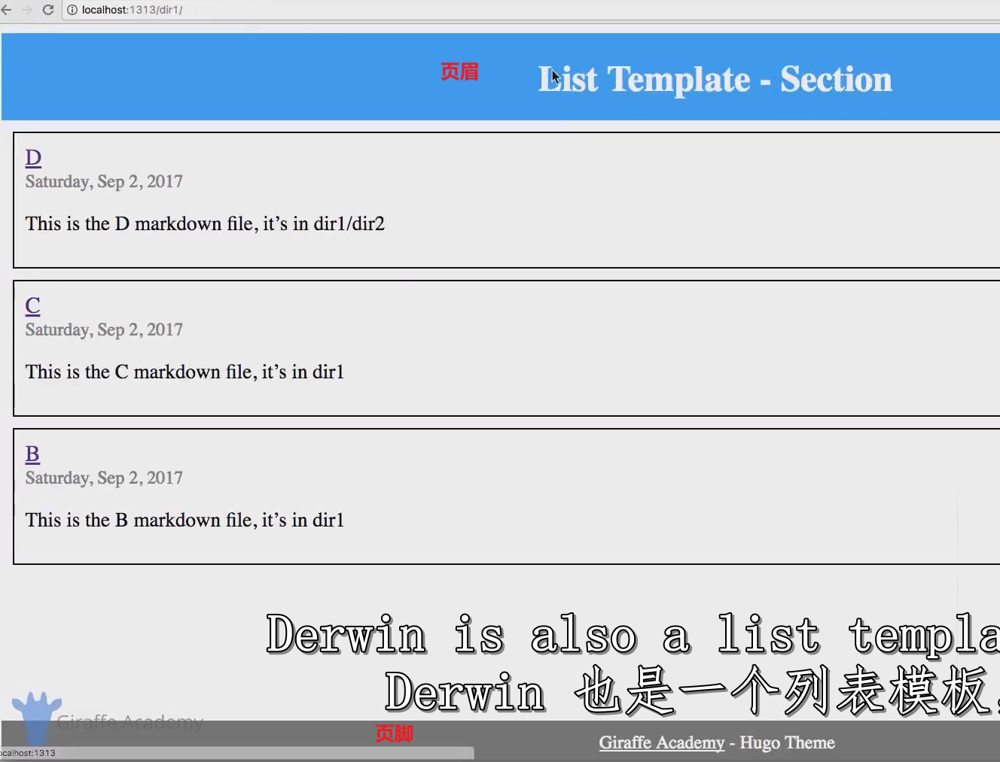
## single template （单页模板）
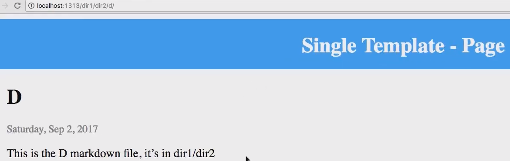  
## 特点
所有的**列表之间**都是长一样的（页眉，页脚，及内容（都是列表））  
所有的**单页之间**都是长一样的（一样的页眉页脚，一样的内容布局）  
## 部分代码解释
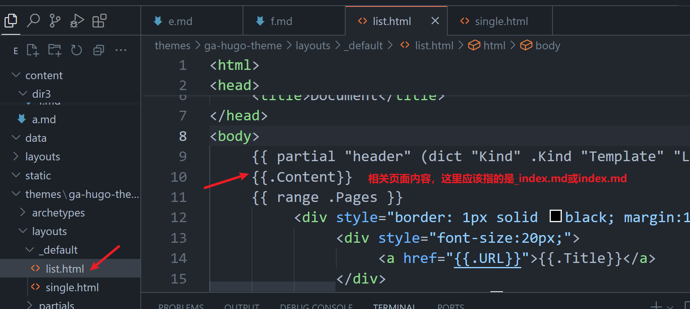  
### 单页探索
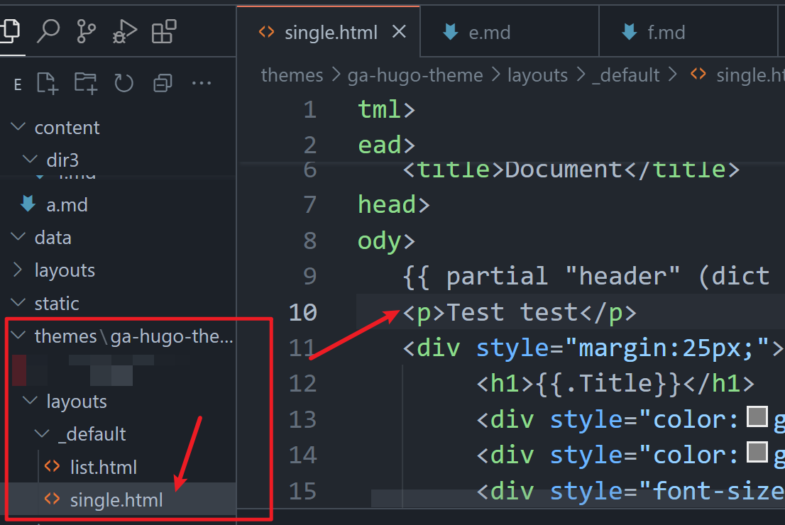  
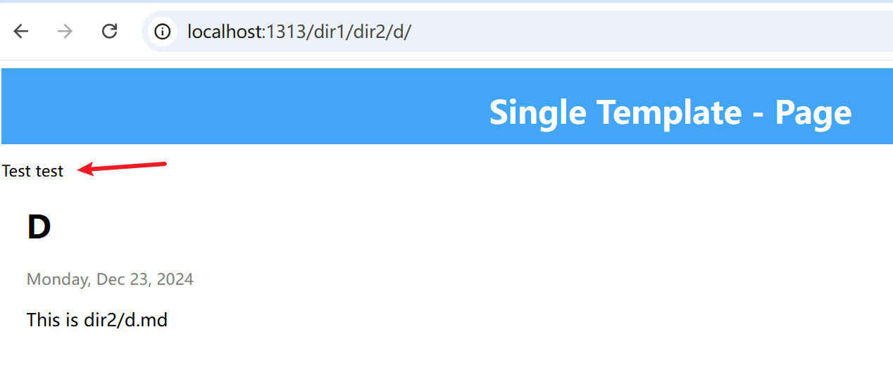  

# list page templates
## 文件夹结构
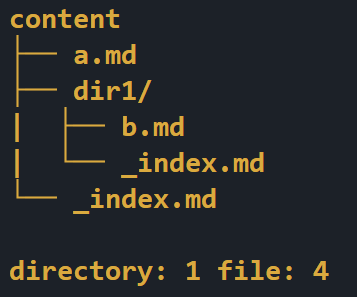  
## 文件内容
```toml 
#content/_index
---
title: "_Index" 
---

This is the home page
#content/dir1/_index
---
title: "_Index"
---

This is the landing page for dir1
```
## 当前效果  
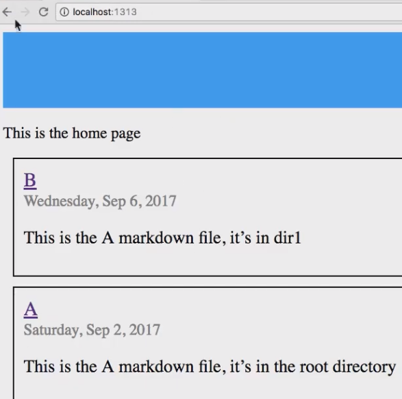  

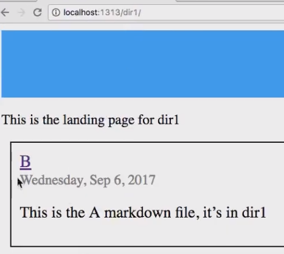  

## 原因 
```html 
 
<!--themes\ga-hugo-theme\layouts\_default\list.html-->
<html>

<head>
     <meta charset="UTF-8">
     <meta name="viewport" content="width=device-width, initial-scale=1.0">
     <meta http-equiv="X-UA-Compatible" content="ie=edge">
     <title>Document</title>
</head>

<body>
     {{ partial "header" (dict "Kind" .Kind "Template" "List") }}
     {{.Content}}
     {{ range .Pages }}
          <div style="border: 1px solid black; margin:10px; padding:10px; ">
               <div style="font-size:20px;">
                    <a href="{{.URL}}">{{.Title}}</a>
               </div>
               <div style="color:grey; font-size:16px;">{{ dateFormat "Monday, Jan 2, 2006" .Date }}</div>
               <div style="color:grey; font-size:16px;">{{ if .Params.tags }}<strong>Tags:</strong> {{range .Params.tags}}<a href="{{ "/tags/" | relLangURL }}{{ . | urlize }}">{{ . }}</a> {{end}}{{end}}</div>
               <div style="color:grey; font-size:16px;">{{ if .Params.categories }}<strong>Categories:</strong> {{range .Params.categories}}<a href="{{ "/categories/" | relLangURL }}{{ . | urlize }}">{{ . }}</a> {{end}}{{end}}</div>
               <div style="color:grey; font-size:16px;">{{ if .Params.moods }}<strong>Moods:</strong> {{range .Params.moods}}<a href="{{ "/moods/" | relLangURL }}{{ . | urlize }}">{{ . }}</a> {{end}}{{end}}</div>

               <p style="font-size:18px;">{{.Summary}}</p>
          </div>
     {{ end }}
     {{ partial "footer" . }}
</body>
</html> 
 

```
## 覆盖默认的list template
编辑文件并保存  
```html  
 
<!--layouts\_default\list.html-->
<html>
<head>
     <meta charset="UTF-8">
     <meta name="viewport" content="width=device-width, initial-scale=1.0">
     <meta http-equiv="X-UA-Compatible" content="ie=edge">
     <title>Document</title>
</head>
<body>
     {{.Content}}  <!--显示对应的目录下的_index.md内容-->
     {{ range .Pages  }} <!--枚举对应目录下所有页面(.md)-->
          <ul>
	          <!--.URL 文件路径，类似 /a或者/dir1/b-->
	          <!--.Title md中的前言-title字段-->
               <li><a href="{{.URL}}">{{.Title}}</a></li>
          </ul> 
     {{end}}
</body>
</html> 
 
```
## 效果
list template简易版  
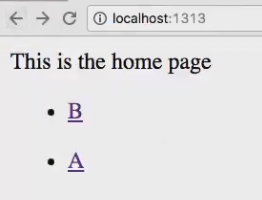  

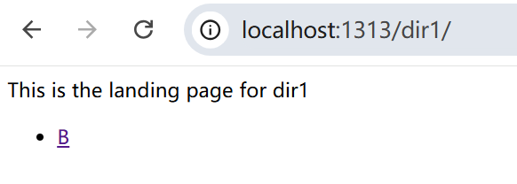  
# single template
## 当前效果  
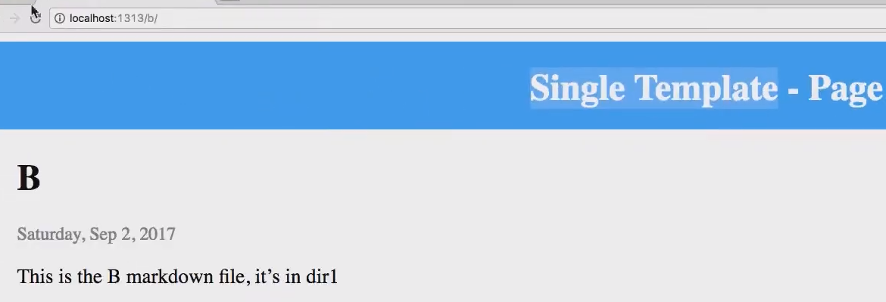  
## 主题默认代码
``` html 
 
<!-- themes\ga-hugo-theme\layouts\_default\single.html -->
<html>
<head>
     <meta charset="UTF-8">
     <meta name="viewport" content="width=device-width, initial-scale=1.0">
     <meta http-equiv="X-UA-Compatible" content="ie=edge">
     <title>Document</title>
</head>
<body>
     {{ partial "header" (dict "Kind" .Kind "Template" "Single") }}
     <p>Test test</p>
     <div style="margin:25px;">
          <h1>{{.Title}}</h1>
          <div style="color:grey; font-size:16px;">{{ dateFormat "Monday, Jan 2, 2006" .Date }}</div>
          <div style="color:grey; font-size:16px;">{{if .Params.author}}Author: {{.Params.Author}}{{end}}</div>
          <div style="font-size:18px;">{{.Content}}</div>
     </div>
     {{ partial "footer" . }}
</body>
</html> 
 
```
## 改编
```html 
 
<!--layouts\_default\single.html-->
<html>
<head>
     <meta charset="UTF-8">
     <meta name="viewport" content="width=device-width, initial-scale=1.0">
     <meta http-equiv="X-UA-Compatible" content="ie=edge">
     <title>Document</title>
</head>
<body> 
  <h1>Header</h1>
  <h3>{{.Title}}</h3>
  <h4>{{.Date}}</h4> <!--特殊项-->
  {{.Content}}
  <h1>Footer</h1>
</body>
</html> 
 
```
效果  
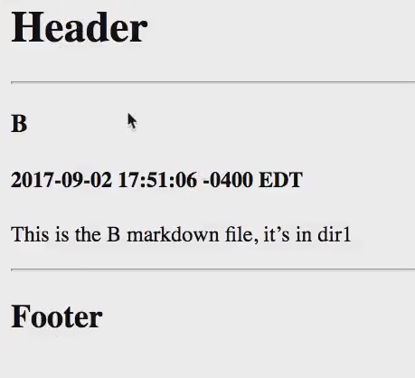  
# home template
## 是什么
- 前面学到，页面分为“列表页面list page”和“单页页面”。其实再细分还有一种“主页页面home page”。
- 主页，即 ```localhost:1313``` 是先使用homepage，找不到的情况，才会使用list page
## 目录结构
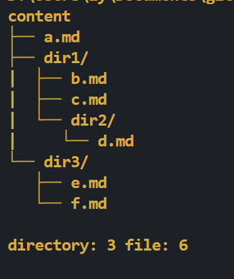  
## 当前效果

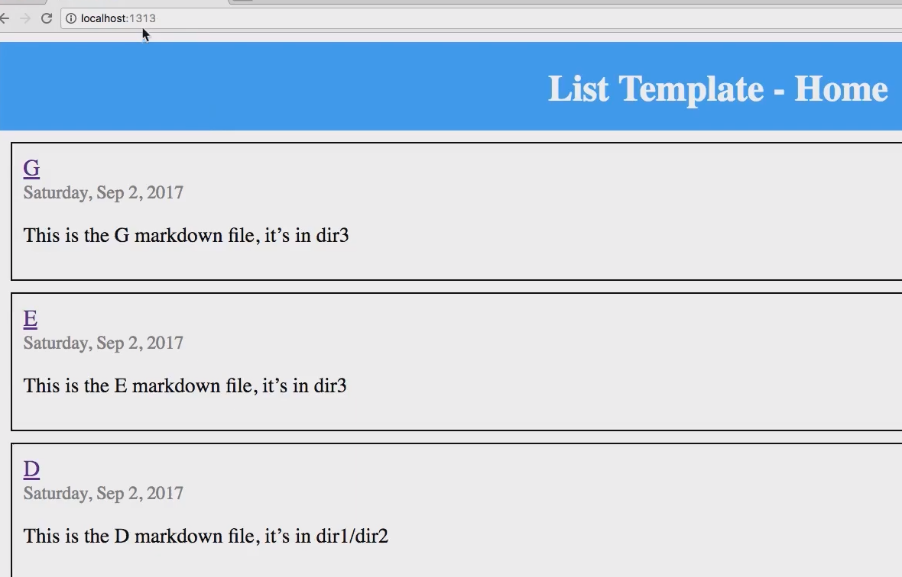  
## 修改文件代码
```html 
 
<!--layouts\index.html-->
Home Page Template 
 
```
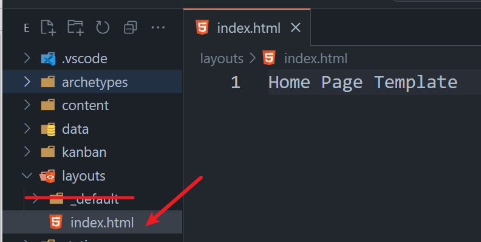  
## 效果
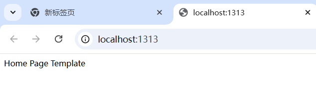  
# SectionTemplate
## 当前目录结构
  
## 目的
不用理会a.md使用哪个当single template。而dir1文件夹下的所有md，都是用同一个single template。  
目前content下所有md文件详情：a.md使用layouts/index.html当模板（没有的话则找layouts```/_default/index.html```当模板）。b.md和c.md、e.md、d.md、f.md均使用```layouts/_default/index.html```当模板  
代码  
``` html 
 
<!--layouts\dir1\single.html-->
<html>
<head>
     <meta charset="UTF-8">
     <meta name="viewport" content="width=device-width, initial-scale=1.0">
     <meta http-equiv="X-UA-Compatible" content="ie=edge">
     <title>Document</title>
</head>
<body> 
  Dir1Template,see!
  <h1>Header</h1>
  <h3>{{.Title}}</h3>
  <h4>{{.Date}}</h4> <!--特殊项-->
  {{.Content}}
  <h1>Footer</h1>
</body>
</html>  
 
```
## 结果
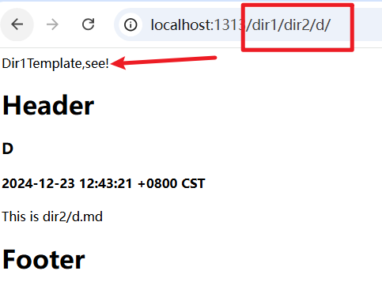  

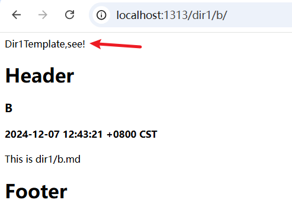  

其他的走默认模板  ```layouts\_default\single.html```  
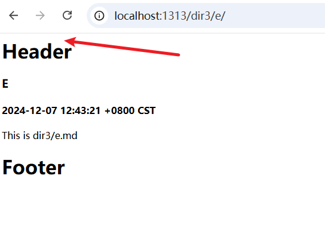  

# Base Templates && Blocks Hugo

## 是什么
BaseTemplate就是这个网站的总体模板
## 案例
### 目录结构
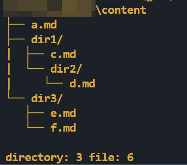  
### 编辑文件
baseof.html  
``` html 
 
<!--layouts\_default\baseof.html-->
<html lang="en">
<head>
  <meta charset="UTF-8">
  <meta name="viewport" content="width=device-width, initial-scale=1.0">
  <title>Document</title>
</head>
<body>
  <!--Hugo实体快，Block-->
  {{ block "main" . }}
    
  {{end}}
</body>
</html> 
 
```

single.html  
**不要用html5的```<!----!>```注释，会出问题**  
``` html 
 
{{ define "main" }}
  This is the single template
{{ end }}  
 
```
list.html
```html 
 
{{/* layouts\_default\single.html */}}
{{ define "main" }}
     This is the listTemplate
{{ end }}  
 
```
效果  
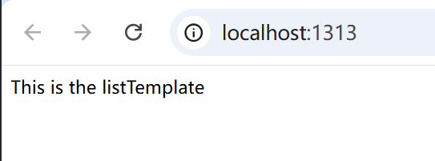  
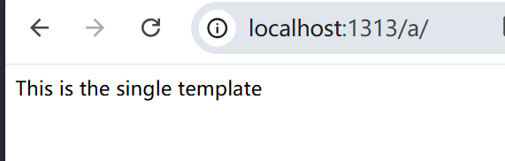  

