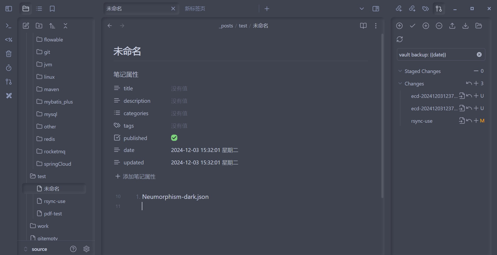
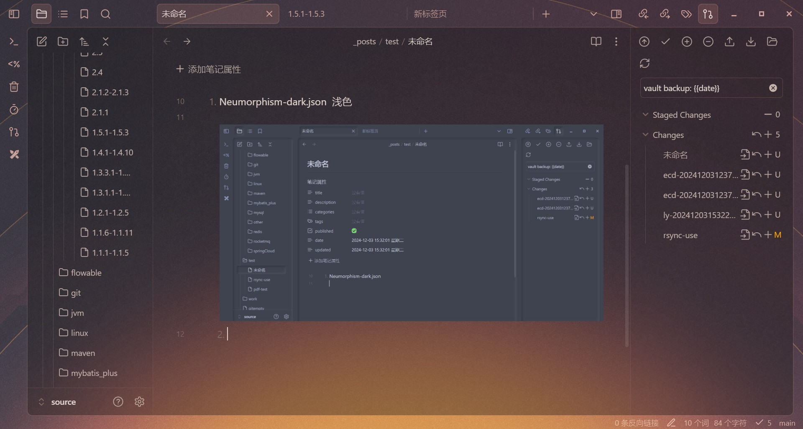
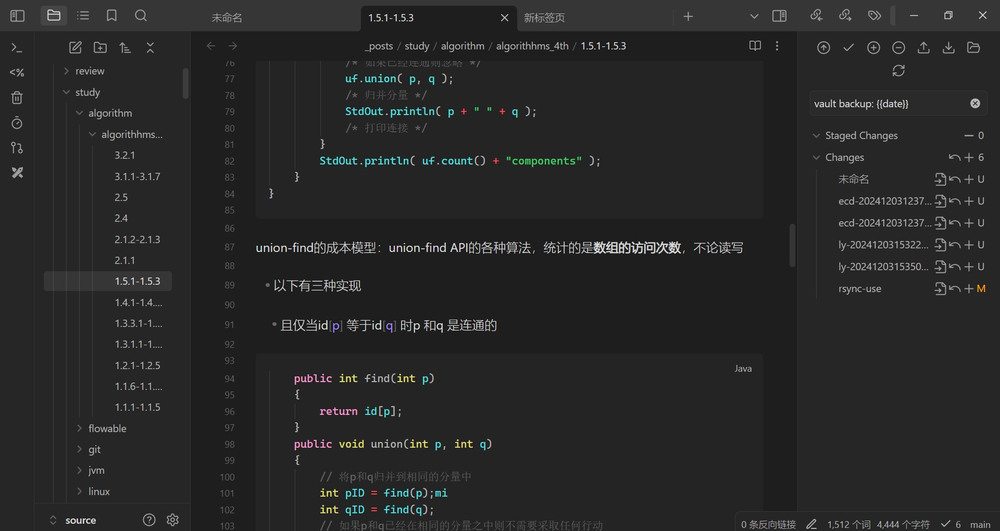
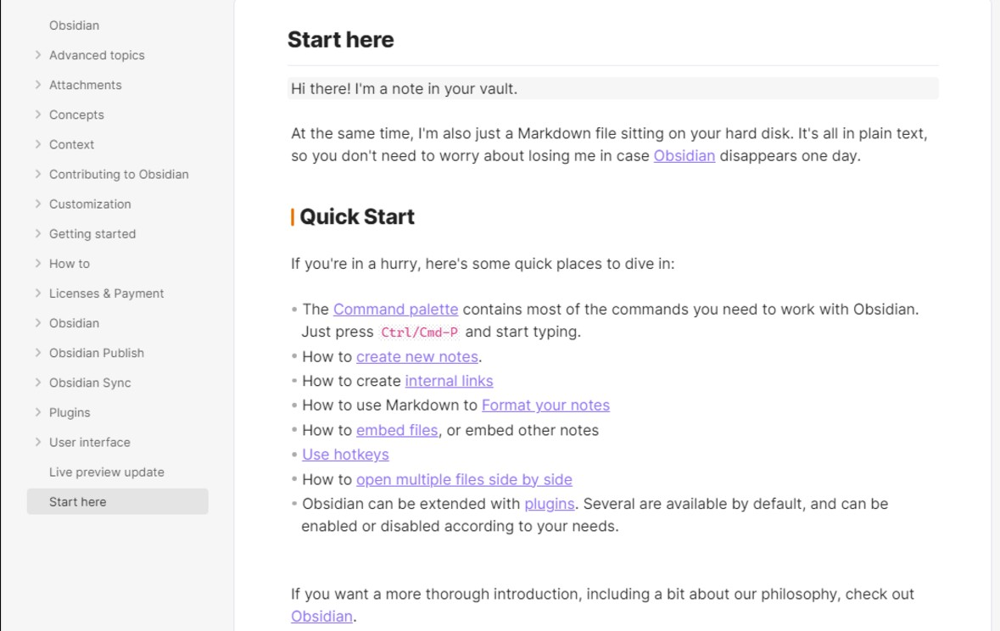
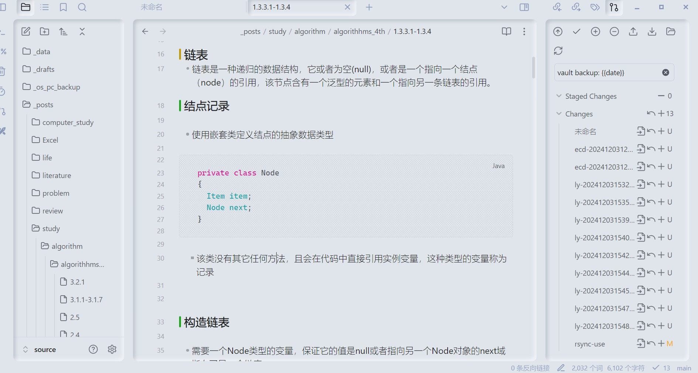
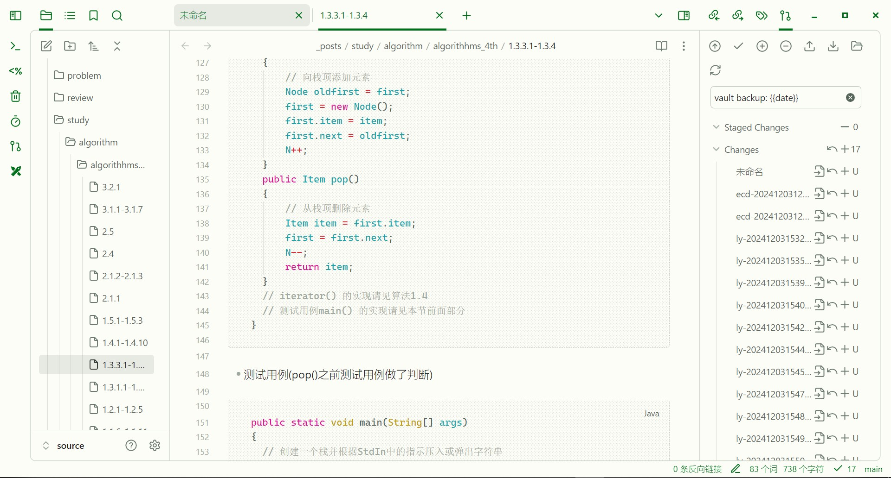
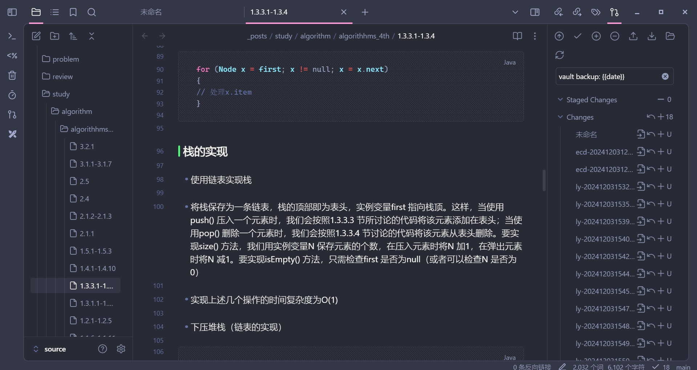
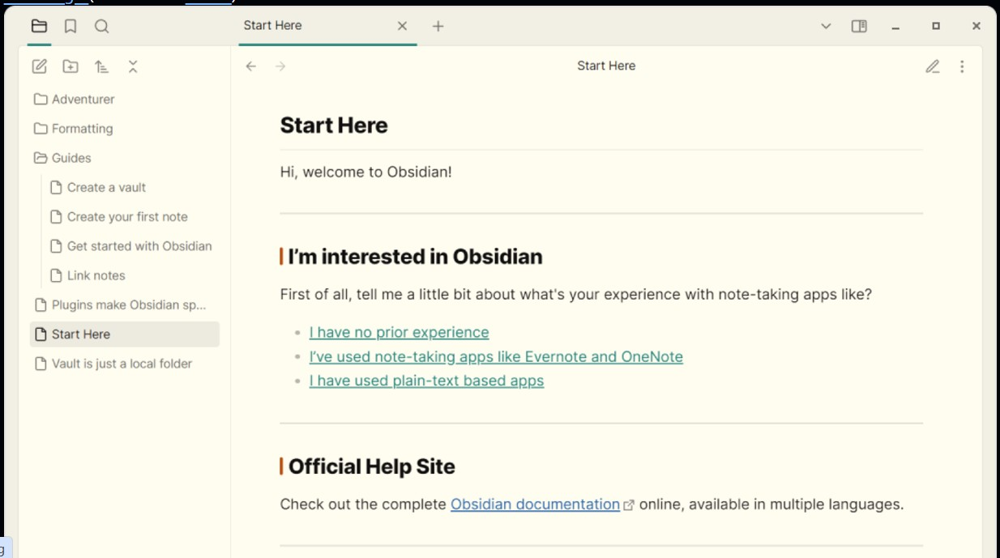
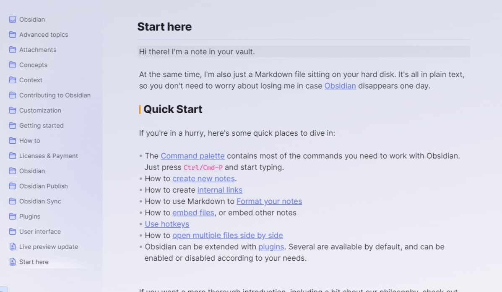
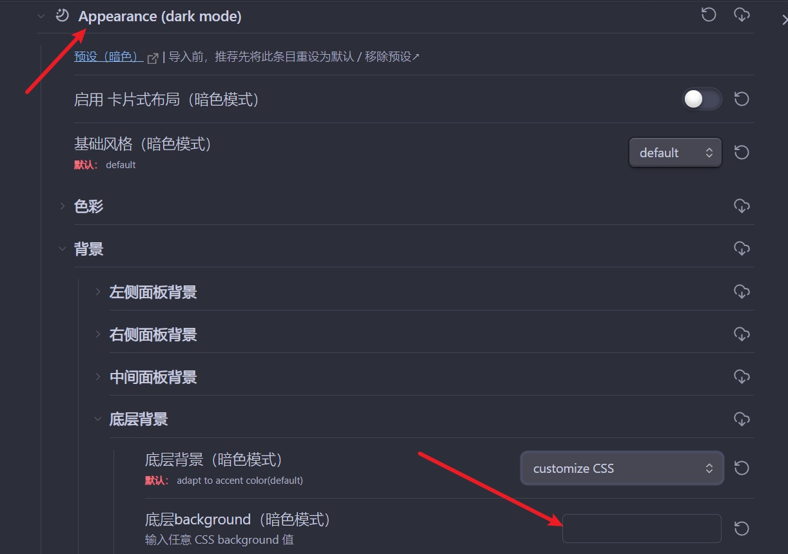

# 主题推荐
1. Neumorphism-dark.json  
    
2. Sunset-base64.json  ✔
   
3. Obsidian-default-dark-alt  ✔
     
   4. Obsidian-default-light-alt 
      
 
8. Neumorphism.json 
   
12. eyefriendly  ✔
    
13. boundy   ✔
    
flexoki-light 
Borderless-light 


# 关于obsidian主题border的背景图片设置  
配合StyleSettings，在StyleSettings的这里设置  
  
## 暂不明确
background中貌似存在转换规则，不是直接用url("")这个形式把图片base64放进来就可以了，目前觉得可能的转换规则  
```shell
%3c 48+12=60  <
%3e 48+14=62   >
%23 32+3=35    #  
#下面的好像没用到，也不确定
%2b  32+11=43  + 
%3b ;
%2c ,
```
后续见另一篇文章   
[border-theme](_posts/study/obsidian/border-theme.md)
